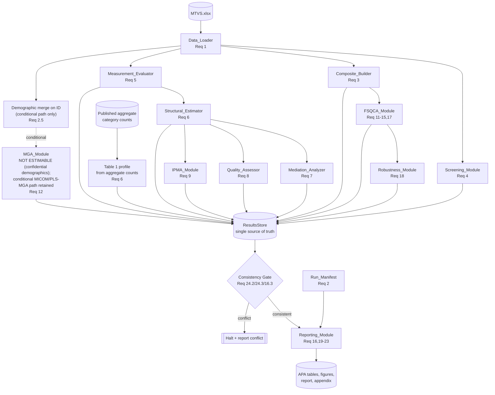

# Design Document

## Overview

This document specifies the technical design for a complete, reproducible, publication-grade analysis pipeline that ingests `MTVS.xlsx` (312 cases; indicators UE1–UE5, UX1–UX5, BSAT1–BSAT4, BSUC1–BSUC4; controls ATT_1, ATT_2; all 7-point Likert in 1–7; no missing values; no duplicates) and produces (a) a full PLS-SEM analysis of a four-construct reflective model and (b) a fuzzy-set Qualitative Comparative Analysis (fsQCA) of configurations leading to High Brand Success, with all results assembled into APA 7th-edition tables, figures, and narrative.

### Dataset Facts (Re-verified This Session)

- `MTVS.xlsx` contains exactly the columns `S.No`, `ID`, the 20 substantive indicators (UE1–UE5, UX1–UX5, BSAT1–BSAT4, BSUC1–BSUC4), and the controls `ATT_1`, `ATT_2`. **There are NO per-respondent demographic columns** (no Gender, Age band, Marital Status, Occupation, Metaverse Engagement Frequency, NFT Interaction, Virtual Event Participation, Social Interaction/Content Creation, or Monthly Family Income fields).
- Demographic information is supplied **only as aggregate Respondent Demographic Profile (Table 1, N = 312) category counts and percentages**, not as per-respondent values. Aggregate counts cannot assign individual respondents to groups.
- **Per-respondent demographics are confidential and unavailable by design.** Respondents were given a confidentiality assurance, and per-respondent demographic values will **not** be released or merged into the analysis dataset. Only the published aggregate category counts (Respondent Demographic Profile, Table 1) are available.
- **Multi-Group Analysis (PART G) is NOT ESTIMABLE for this dataset.** Because individual respondents cannot be assigned to demographic groups, hypothesis **H4 (demographic moderation) is not testable** with the available data; Multi-Group Analysis is reported as **not estimable** (Requirement 12) and is described descriptively only. Table 1 is produced from the published aggregate counts (Requirement 6). The ID-keyed merge + MICOM + permutation/PLS-MGA procedure is retained solely as an **optional, conditional path** that would apply only if non-confidential per-respondent demographic data ever became available internally (Requirement 2); the `Data_Loader` continues to detect demographic columns and record their absence gracefully (Requirement 1.10–1.12).

The design realizes the 26 requirements in `requirements.md`. It commits to a concrete implementation stack, defines every statistical procedure with thresholds and citations, fixes a single source-of-truth results store to guarantee internal consistency, and enumerates executable correctness properties suitable for property-based testing.

### Design Goals

1. **Reproducibility first.** Every stochastic step is seeded; a `Run_Manifest` records language/package versions, the seed, the input-file content hash, and a timestamp. Two runs with the same input and seed reproduce reported statistics to >= 3 decimals (Req 2).
2. **Internal-consistency enforcement.** A single immutable `ResultsStore` holds every statistic. Any artifact (table, figure caption, decision table, narrative) reads from the store; the same statistic is rendered identically everywhere. A consistency gate halts the build if any duplicated statistic disagrees (Req 24.2, 24.3, 16.3).
3. **APA-publication output.** Tables are APA 7th-edition formatted; figures render at >= 300 DPI raster or vector; numbers use consistent 2–3 decimal precision (Req 19, 20).
4. **Method rigor with traceable thresholds.** Every threshold-based decision records the observed value and the applied threshold with a methodological citation (Req 24.1, 24.4).
5. **Honest reporting under confidential demographics.** Components whose preconditions are absent record their state explicitly rather than fabricate output. Per-respondent demographic values are **confidential and unavailable by design**, so Multi-Group Analysis is reported as **NOT ESTIMABLE** for this dataset and hypothesis H4 is recorded as not testable (Req 2.4, 12.1). Table 1 is produced from the published aggregate counts only (Req 6.1). The ID-keyed merge + MICOM/PLS-MGA procedure is retained only as a clearly-marked **conditional path** that would apply if non-confidential per-respondent demographic data ever became available internally (Req 2.5).

### Implementation Stack Decision

The pipeline is implemented in **R** (the requirement layer is tool-agnostic; this design commits to R as the primary stack).

| Concern | Library | Role |
|---|---|---|
| Ingest | `readxl` | Read `MTVS.xlsx` single sheet |
| Hashing/provenance | `digest`, `sessioninfo` | Input-file hash, `Run_Manifest` |
| Descriptives / reliability | `psych` | Skewness, kurtosis, alpha, correlations |
| Screening diagnostics | `car`, `olsrr`, `stats` | VIF, Mahalanobis, Cook's distance |
| PLS-SEM | `seminr` | Measurement & structural model, 5000-resample bootstrap (BCa), HTMT, model fit (SRMR/NFI/RMS_theta/d_ULS/d_G), f2, Q2 (blindfolding), PLSpredict, IPMA |
| fsQCA | `QCA`, `SetMethods` | Calibration, necessity (+RoN), truth table, minimization (complex/parsimonious/intermediate), XY plots, robustness |
| Figures | `ggplot2`, `corrplot`, `GGally` | Histograms, density, Q-Q, heatmap, scatterplot matrix, IPMA map, fsQCA plots |
| Tables / report | `gt`, `flextable`, `rmarkdown`, `knitr` | APA tables, 300-DPI figure export, report assembly, appendix |

**Python equivalents (noted for portability, not used as primary):** `pandas`/`openpyxl` (ingest), `plspm` or `semopy` (PLS-SEM; `semopy` is covariance-based SEM so only a partial substitute), `fuzzy-set QCA` libraries such as the community `fsqca`/`pyqca` ports (fsQCA), `pingouin`/`statsmodels` (reliability, VIF, regression diagnostics), `matplotlib`/`seaborn` (figures). The R stack is preferred because `seminr` and `QCA`/`SetMethods` are the de-facto reference implementations cited in the methodological literature.

A fixed seed (`SEED = 20240701`, recorded in the manifest) is set before any bootstrap, blindfolding, permutation, or resampling call.

## Architecture

### Component Overview

The pipeline is a directed acyclic flow of modules. Each module consumes typed inputs, writes its results into the shared `ResultsStore`, and emits artifacts (tables/figures) through the `Reporting_Module`. The `ResultsStore` is the single source of truth; modules never render final artifacts directly.



### End-to-End Data-Flow Pipeline

1. **Ingest & validate** — `Data_Loader` reads `Sheet1`, checks columns/range/row-count, drops `S.No`/`ID` from computation (retains `ID` as label), produces `analysis_df`.
2. **Provenance** — manifest builder records seed, package versions, file hash, timestamp.
3. **Screening** — `Screening_Module` runs sample-size adequacy, missingness, duplicates, Mahalanobis, IQR outliers, Cook's distance, normality, multicollinearity (VIF), and descriptive/correlation/covariance matrices.
4. **Composites** — `Composite_Builder` computes mean composites UE, UX, BSAT, BSUC for fsQCA and descriptives.
5. **Measurement model** — `Measurement_Evaluator` fits the reflective model: loadings, weights, reliability, AVE, Fornell-Larcker, HTMT, full-collinearity VIF, CMB, model fit.
6. **Structural model** — `Structural_Estimator` estimates standardized paths and runs the 5000-resample BCa bootstrap.
7. **Mediation / quality / IPMA** — derived from the bootstrapped structural model.
8. **Demographic reporting & MGA (not estimable)** — per-respondent demographics are confidential and unavailable by design, so `MGA_Module` reports Multi-Group Analysis as **NOT ESTIMABLE** and records H4 as not testable (Req 2.4, 12.1), and `Reporting_Module` emits the Respondent Demographic Profile (Table 1) from the published aggregate counts (Req 6.1). The ID-keyed merge + MICOM/PLS-MGA across the nine Grouping_Variables (preserving 312 rows) is retained only as a conditional path that would run if non-confidential per-respondent demographics became available internally (Req 2.5).
9. **fsQCA** — `FSQCA_Module` calibrates, runs necessity, builds the truth table, minimizes, and reports configurations + plots.
10. **Robustness** — `Robustness_Module` re-runs fsQCA under alternative analytic choices.
11. **Consistency gate** — verifies duplicated statistics agree; halts on conflict.
12. **Reporting** — `Reporting_Module` assembles APA tables, figures, decision tables, discussion, conclusion, and supplementary appendix.

### Module Responsibility Matrix

| Module | Requirements | Primary outputs |
|---|---|---|
| Data_Loader | 1 | `analysis_df`, structural-validation report, demographic-column detection & validation (Req 1.10–1.12), confidentiality-status record + MGA-not-estimable report (Req 2.2–2.4); conditional ID-keyed demographic merge (Req 2.5) |
| Run_Manifest builder | 2 | `Run_Manifest` |
| Composite_Builder | 3 | composite scores + descriptives |
| Screening_Module | 4 | screening report, diagnostic figures/tables |
| Measurement_Evaluator | 5 | measurement-model tables |
| Structural_Estimator | 6 | path estimates, bootstrap CIs, path diagram |
| Mediation_Analyzer | 7 | indirect/direct/total effects, VAF, mediation type |
| Quality_Assessor | 8 | R²/f²/Q²/PLSpredict |
| IPMA_Module | 9 | importance-performance map + table |
| MGA_Module | 12 (not estimable for this dataset) | Multi-Group Analysis reported **NOT ESTIMABLE** (confidential demographics): records H4 as not testable and names the required Grouping_Variables (Req 2.4, 12.1, 12.2). **Conditional MICOM/PLS-MGA path retained** — where non-confidential per-respondent demographics become available internally, runs MICOM, permutation + PLS-MGA per path, subgroup adequacy, and an APA multi-group results table (Req 12.3–12.9) |
| FSQCA_Module | 11–15, 17 | calibration, necessity, truth table, solutions, plots |
| Robustness_Module | 18 | robustness comparison |
| Reporting_Module | 16, 19–24 (+ Table 1: Req 6) | APA tables, figures, narrative, appendix, consistency gate, Respondent Demographic Profile (Table 1) from published aggregate counts with confidential/MGA-not-estimable annotation |

## Components and Interfaces

Each module is described with its inputs, procedure (with thresholds, formulas, and citations), and outputs written to the `ResultsStore`. Conceptual R signatures are given; the spec deliverable remains `design.md`.

### Data_Loader (Requirement 1)

**Input:** path to `MTVS.xlsx`. **Output:** `analysis_df`, `structural_validation` record.

Procedure:
- Read the single worksheet via `readxl::read_excel` (Req 1.1).
- Assert presence of the 20 substantive indicators and of `ATT_1`/`ATT_2`; on any missing required indicator, **halt** and report the missing names (Req 1.2–1.4).
- For each substantive indicator, count values outside the closed interval [1, 7] and non-integers; report counts per indicator (Req 1.5). Out-of-range values are recorded (indicator, `ID`, value) and processing continues (Req 1.6). If zero out-of-range values, the out-of-range report is **skipped, not emitted empty** (Req 1.7).
- Report observed row count and whether it equals 312 (Req 1.8).
- Drop `S.No` and `ID` from all statistical inputs; retain `ID` as a case label vector (Req 1.9).
- **Demographic-column detection (Req 1.10–1.12).** Detect whether the nine per-respondent demographic grouping columns — Gender, Age band, Marital Status, Occupation, Metaverse Engagement Frequency, NFT Interaction, Virtual Event Participation, Social Interaction/Content Creation, and Monthly Family Income — are present. Where present, report each variable's observed category count and percentage and compare every category frequency against the expected Respondent Demographic Profile (Table 1; N = 312), flagging any deviation (Req 1.11). Where one or more demographic columns are absent, record that per-respondent demographic data is unavailable, record the confidentiality status and that Multi-Group Analysis is NOT ESTIMABLE (Req 2.4, 12.1), and continue executing the non-grouping analysis stages (Req 1.12). The current `MTVS.xlsx` triggers this absence branch, consistent with the confidential-by-design demographics.

```r
load_data(path) -> list(analysis_df, id_labels, validation, demographics_present)
```

### Demographic Status and Conditional Merge (Requirement 2)

**Input:** `analysis_df` (keyed by `ID`). **Output:** a confidentiality-status record and an MGA-not-estimable report; *conditionally*, a `merged_df` if non-confidential per-respondent demographics ever become available internally.

**Primary behavior (this dataset).** Per-respondent demographic values are **confidential and unavailable by design**: respondents were given a confidentiality assurance, and those values will **not** be released or merged. The current `MTVS.xlsx` contains only `S.No`, `ID`, the 20 substantive indicators, and `ATT_1`/`ATT_2`; the aggregate Table 1 counts are insufficient to assign individual respondents to groups (Req 2.2, 2.3). Accordingly, the `Data_Loader` **records the confidentiality status** — naming the nine Grouping_Variables that Multi-Group Analysis would require and stating that the published aggregate counts are the only demographic data available — and the `MGA_Module` **reports Multi-Group Analysis as NOT ESTIMABLE** and records hypothesis H4 as not testable with the available data (Req 2.1–2.4, 12.1).

##### Conditional Merge Path (CONDITIONAL — applies only if non-confidential per-respondent demographic data becomes available internally)

The following documented merge procedure is retained **only** for the conditional case in which non-confidential per-respondent demographic values become available internally (Req 2.5–2.7). It is **not exercised for the current dataset.**

- **Join on `ID`.** Left-join the demographic frame to `analysis_df` on the `ID` case label, preserving the row count at exactly 312 (Req 2.5). The merge is a bijection on `ID`: every analysis row matches exactly one demographic row and vice versa (basis of the conditional Correctness Property 21).
- **Category-total validation.** For each demographic variable, validate that its merged category frequencies match the expected Respondent Demographic Profile (Table 1) and that the category counts sum to exactly 312. **Halt with a reported discrepancy** when any demographic variable's category counts do not sum to 312 (Req 2.6).
- **Expected category counts (Table 1; N = 312)** used for validation:

| Demographic variable | Categories (expected count) |
|---|---|
| Gender | Male (143), Female (169) |
| Age (Years) | 18–22 (64), 23–28 (75), 29–34 (60), 35–41 (57), 42–45 (56) |
| Marital Status | Single (107), Married with children (84), Married without children (121) |
| Occupation | Students (88), Job (102), Business (122) |
| Metaverse Engagement Frequency | Daily (52), Several times a week (98), Weekly (73), Monthly (54), Rarely (35) |
| NFT Interaction | Yes (141), No (171) |
| Virtual Event Participation | Yes (129), No (183) |
| Social Interaction/Content Creation | Yes (164), No (148) |
| Monthly Family Income | INR ≤ 30,000 (57), INR 30,001–50,000 (80), INR 50,001–80,000 (100), INR 80,001+ (75) |

- **MGA on merged data.** Where the merge succeeds, the `MGA_Module` performs Multi-Group Analysis as specified in the conditional block of Requirement 12 (MICOM followed by permutation/PLS-MGA testing) (Req 2.7).

```r
# Primary: record confidentiality status; MGA reported NOT ESTIMABLE
record_demographic_status(analysis_df) -> list(confidential_record, mga_not_estimable)
# Conditional only (non-confidential per-respondent data available internally):
merge_demographics(analysis_df, demo_df) -> list(merged_df, validation)
```

### Run_Manifest Builder (Requirement 2)

Sets `set.seed(SEED)` once at pipeline start (Req 2.1). All stochastic procedures (`seminr` bootstrap, blindfolding, PLSpredict CV folds, fsQCA bootstrap/leave-one-out) draw from the seeded RNG so reruns are bit-identical (Req 2.2, 2.4). The manifest records: R version, every package name + version (`sessioninfo::session_info`), seed, input filename, SHA-256 content hash of the file (`digest::digest(file=...)`), run timestamp, and the chosen stack ("R" with `seminr` for PLS-SEM and `QCA`/`SetMethods` for fsQCA) (Req 2.3, 2.5).

### Composite_Builder (Requirement 3)

Computes `UE = mean(UE1..UE5)`, `UX = mean(UX1..UX5)`, `BSAT = mean(BSAT1..BSAT4)`, `BSUC = mean(BSUC1..BSUC4)` (Req 3.1). Missing-value rule: **available-case mean** — a composite is the mean of the non-missing indicators of that construct; if all indicators of a construct are missing the composite is `NA`. The rule is recorded and the per-construct count of affected cases reported (Req 3.2, 3.3). For the current file this count is **0** (Req 3.4). Reports min/max/mean/SD per composite (Req 3.5).

Because indicators are bounded in [1, 7], each composite is mathematically bounded in [1, 7] (basis of Correctness Property CP-1).

### Screening_Module (Requirement 4)

| Check | Procedure / formula | Threshold & citation |
|---|---|---|
| Sample-size adequacy (4.1) | Inverse-square-root method and 10× rule for the most complex regression (max predictors into any endogenous construct = 3 into BSUC) | report achieved n=312 vs minimum (Hair et al., 2022) |
| Missing-value analysis (4.2) | count + % per indicator and overall | report-only |
| Duplicates (4.3) | by `ID` and full-row | report-only |
| Multivariate outliers (4.4) | Mahalanobis D² = (x−μ)ᵀ S⁻¹ (x−μ) over the 20 indicators; compare to χ²(df=20) critical value at p < 0.001 | flag D² > χ²₀.₉₉₉,₂₀ ≈ 45.315 |
| Univariate outliers (4.5) | per-indicator boxplots; 1.5×IQR rule (below Q1−1.5·IQR or above Q3+1.5·IQR) | report flagged |
| Influence (4.6) | composite regression BSUC ~ UE+UX+BSAT; Cook's D per case; flag only when both Cook's D and 4/n are finite and D > 4/n | 4/n threshold |
| Normality (4.7) | mean, SD, skewness, kurtosis per indicator | flag \|skew\| > 2 or \|kurtosis\| > 7 (Byrne, 2016) |
| Distribution figures (4.8) | histogram, density, Q-Q per indicator | — |
| Relationship figures (4.9) | correlation heatmap + scatterplot matrix | — |
| Matrices (4.10) | descriptives, Pearson correlations, covariance | feeds PART M |
| Multicollinearity (4.11) | VIF of predictors for each endogenous construct | flag VIF >= 5 (Hair et al., 2022) |

### Measurement_Evaluator (Requirement 5)

Fits the reflective measurement model with `seminr`. Outputs:
- Standardized outer loadings; flag < 0.708 (Req 5.1; Hair et al., 2022).
- Outer weights, communality, redundancy (Req 5.2).
- Cross-loadings table (Req 5.3).
- Indicator reliability = (loading)²; flag < 0.50 (Req 5.4).
- Cronbach's alpha, rho_A, composite reliability; flag < 0.70 or > 0.95, treating 1.0 as exceeding the upper bound (Req 5.5; Hair et al., 2022).
- AVE per construct; flag < 0.50 (Req 5.6). AVE = (Σλᵢ²)/n where λ are standardized loadings — bounded [0,1] (basis of CP-3).
- Fornell-Larcker: flag where √AVE of a construct is not greater than its correlations with others (Req 5.7).
- HTMT for every pair; flag >= 0.85 (conservative) and >= 0.90 (liberal) (Req 5.8; Henseler et al., 2015).
- Inner-model full-collinearity VIF per construct; flag >= 3.3 as potential CMB (Req 5.9; Kock, 2015).
- Common-method-bias assessment via Harman's single-factor test + full-collinearity VIF (Req 5.10). If no CMB test was performed, record an explicit **validation failure** (Req 5.11).
- Model fit: SRMR, NFI, RMS_theta, d_ULS, d_G; flag SRMR > 0.08 (Req 5.12; Henseler et al., 2014).
- Chi-square: where available report it; for PLS-SEM state "not applicable" and explain that PLS-SEM is variance-based with no global ML χ² (Req 5.13).

### Structural_Estimator (Requirement 6)

Estimates standardized path coefficients for the five paths UE→BSAT, UX→BSAT, UE→BSUC, UX→BSUC, BSAT→BSUC (Req 6.1). Runs `seminr::bootstrap_model` with **5000 resamples** and **bias-corrected and accelerated (BCa)** confidence intervals (Req 6.2; Hair et al., 2022). Per path reports standardized β, SE, t-statistic, p-value, 95% CI (Req 6.3). Records decision "supported"/"rejected" at two-tailed p < 0.05 and also reports significance at p < 0.01 and p < 0.001 (Req 6.4). Produces an annotated structural path diagram with standardized coefficients and significance markers (Req 6.5). Control variables ATT_1/ATT_2 are added as predictors of BSUC **only if** they increase BSUC R² by a documented margin; otherwise the comparison justifying exclusion is reported (Req 6.6).

### Mediation_Analyzer (Requirement 7)

Computes specific indirect effects UE→BSAT→BSUC and UX→BSAT→BSUC as products of constituent path coefficients (Req 7.1). Per indirect effect reports point estimate, SE, t, p, and bias-corrected 95% CI from the same 5000-resample bootstrap (Req 7.2). Reports direct, indirect, and total effects for UE→BSUC and UX→BSUC, where total = direct + indirect (Req 7.3). Computes **VAF = indirect / total** for each mediated relationship (Req 7.4). Classifies mediation using Zhao et al. (2010) and Nitzl et al. (2016) logic plus VAF thresholds: VAF < 0.20 = no mediation, 0.20–0.80 = partial, > 0.80 = full (Req 7.5; Hair et al., 2022). An indirect effect whose bootstrap CI excludes zero is recorded as statistically significant (Req 7.6).

### Quality_Assessor (Requirement 8)

- R² and adjusted R² for BSAT and BSUC; interpret against 0.25/0.50/0.75 (Req 8.1; Hair et al., 2022).
- f² for every predictor→endogenous relationship: f² = (R²_included − R²_excluded)/(1 − R²_included); interpret against 0.02/0.15/0.35 (Req 8.2; Cohen, 1988).
- Q² via blindfolding per endogenous construct; predictive relevance when Q² > 0 (Req 8.3).
- PLSpredict: RMSE, MAE, MAPE for the key endogenous construct's (BSUC) indicators (Req 8.4).
- Compare PLS-SEM PLSpredict errors against the naive linear-model (LM) benchmark per indicator; record whether PLS error < benchmark error (Req 8.5).
- Classify predictive power by the proportion of indicators where PLS beats the benchmark: 0% = none, >0–25% = low, >25–75% = medium, >75% = high (Req 8.6; Shmueli et al., 2019).

### IPMA_Module (Requirement 9)

Computes total effect (importance) and rescaled mean score (performance, rescaled to 0–100) of UE, UX, BSAT with respect to target BSUC (Req 9.1). Produces a four-quadrant importance-performance map placing each predictor (Req 9.2), a table of importance/performance values (Req 9.3), and managerial implications identifying high-importance/low-performance constructs as highest improvement potential (Req 9.4).

### MGA_Module (Requirement 12, NOT ESTIMABLE for this dataset — confidential demographics)

Multi-Group Analysis tests H4 (demographic moderation of structural relationships). For this dataset it is **NOT ESTIMABLE**: per-respondent demographic values are **confidential and unavailable by design** and will not be supplied, so individual respondents cannot be assigned to demographic groups. The `MGA_Module` therefore **reports Multi-Group Analysis as NOT ESTIMABLE**, records hypothesis **H4 as not testable** with the available data (reported descriptively only), and names the Grouping_Variables that Multi-Group Analysis would require, stating that per-respondent values for them will not be supplied (Req 12.1, 12.2, 2.4).

The full MICOM → permutation/PLS-MGA design below is retained as a **CONDITIONAL block** that would be executed **only** if non-confidential per-respondent demographic data became available internally and were merged on `ID` (Req 2.5–2.7, 12.3). It is **not exercised for the current `MTVS.xlsx`.**

##### Conditional Block (applies only WHERE non-confidential per-respondent demographic data is available internally)

Where the conditional merge supplies `merged_df`, the module runs the full pipeline across all nine Grouping_Variables.

**Grouping_Variables and comparison strategy (Req 12.4).**

- **Dichotomous variables** — Gender, NFT Interaction, Virtual Event Participation, and Social Interaction/Content Creation — are handled as **direct two-group comparisons**.
- **Multi-category variables** — Age band, Marital Status, Occupation, Metaverse Engagement Frequency, and Monthly Family Income — are compared either through **pairwise comparisons of all category pairs** or through the **Overall Test of Group differences (OTG)/omnibus** approach. The chosen strategy is **documented per variable**: omnibus OTG is used as the primary screen for any variable with more than three categories (Age, Metaverse Engagement Frequency, Monthly Family Income), with significant omnibus results followed by pairwise PLS-MGA; variables with exactly three categories (Marital Status, Occupation) use exhaustive pairwise comparisons.

**Step 1 — Measurement invariance via MICOM (Req 12.4; Henseler et al., 2016).** For each Grouping_Variable, run the three-step MICOM procedure:
1. **Configural invariance** — confirm identical indicator/construct specification, data treatment, and algorithm settings across groups.
2. **Compositional invariance** — test that composite scores are formed equivalently across groups (permutation test on the correlation of construct scores; invariance held when the correlation is not significantly below 1).
3. **Equality of composite means and variances** — permutation tests on group differences in composite means and variances.
Full invariance permits pooled comparison; **partial invariance (steps 1–2 established) is sufficient to proceed** to path comparison.

**Step 2 — Group comparison via permutation + PLS-MGA (Req 12.5, 12.6; Hair et al., 2022).** Where at least partial measurement invariance holds, run a **permutation test** and the **PLS-MGA test** for each of the five structural paths (UE→BSAT, UX→BSAT, UE→BSUC, UX→BSUC, BSAT→BSUC). Per path-by-group comparison report:
- the **standardized path estimate per group**,
- the **absolute group difference** |β_group1 − β_group2|,
- the **p-value of the difference**, and
- a **decision of significant vs non-significant group difference at a two-tailed threshold of p ≤ 0.05** (basis of Correctness Property 22).

**Step 3 — Subgroup sample-size adequacy (Req 12.7, 12.8).** For each subgroup, evaluate adequacy against the **inverse-square-root method** and the **10-times rule** applied per subgroup (most complex regression = 3 predictors into BSUC). Flag any subgroup that is **underpowered** for structural estimation. When a subgroup is flagged, report the affected comparison with an explicit caution while **still reporting** the estimated group difference and its p-value (basis of Correctness Property 23).

**Output (Req 12.9).** An APA-formatted multi-group results table reporting, per Grouping_Variable and per structural path, the per-group path estimates, the group difference, the difference p-value, and the invariance decision, with underpowered subgroups annotated.

### FSQCA_Module (Requirements 11–15, 17)

The fsQCA design is detailed in its own section below.

### Robustness_Module (Requirement 18)

Detailed in the Robustness Design section below.

### Reporting_Module (Requirements 16, 19–24)

Detailed in the Reporting Design section below.

## Data Models

### Analysis Dataset (`analysis_df`)

| Field | Type | Notes |
|---|---|---|
| `ID` | label (retained, excluded from stats) | case identifier (Req 1.9) |
| `UE1`–`UE5` | integer 1–7 | UE indicators |
| `UX1`–`UX5` | integer 1–7 | UX indicators |
| `BSAT1`–`BSAT4` | integer 1–7 | BSAT indicators |
| `BSUC1`–`BSUC4` | integer 1–7 | BSUC indicators |
| `ATT_1`, `ATT_2` | integer 1–7 | optional controls |

`S.No` is dropped entirely; `ID` is excluded from computation but retained as a label.

### Merged Demographic Dataset (`merged_df`) — conditional path only

This dataset exists **only on the conditional path** where non-confidential per-respondent demographic data becomes available internally and is joined via the ID-keyed merge (Req 2.5). It is **not produced for the current dataset** (per-respondent demographics are confidential). When produced, it extends `analysis_df` with the nine categorical Grouping_Variables, preserving exactly 312 rows.

| Field | Type | Notes |
|---|---|---|
| `ID` | label (join key) | bijective merge key; 312 unique values |
| (all `analysis_df` fields) | — | indicators + controls, unchanged |
| `Gender` | factor | Male, Female |
| `Age_band` | factor (ordered) | 18–22, 23–28, 29–34, 35–41, 42–45 |
| `Marital_Status` | factor | Single, Married with children, Married without children |
| `Occupation` | factor | Students, Job, Business |
| `Metaverse_Engagement` | factor (ordered) | Daily, Several times a week, Weekly, Monthly, Rarely |
| `NFT_Interaction` | factor | Yes, No |
| `Virtual_Event` | factor | Yes, No |
| `Social_Content` | factor | Yes, No |
| `Monthly_Income` | factor (ordered) | INR ≤ 30,000; 30,001–50,000; 50,001–80,000; 80,001+ |

**Expected category counts (Table 1; N = 312)** — the validation reference for Table 1 reporting from published aggregate counts (Req 6) and, on the conditional path only, for the merge (Req 2.6):

| Demographic variable | Categories (expected count; expected %) |
|---|---|
| Gender | Male (143; 46.00%), Female (169; 54.00%) |
| Age (Years) | 18–22 (64; 20.51%), 23–28 (75; 24.04%), 29–34 (60; 19.23%), 35–41 (57; 18.27%), 42–45 (56; 17.95%) |
| Marital Status | Single (107; 34.29%), Married with children (84; 26.93%), Married without children (121; 38.78%) |
| Occupation | Students (88; 28.21%), Job (102; 32.69%), Business (122; 39.10%) |
| Metaverse Engagement Frequency | Daily (52; 16.67%), Several times a week (98; 31.41%), Weekly (73; 23.38%), Monthly (54; 17.31%), Rarely (35; 11.21%) |
| NFT Interaction | Yes (141; 45.19%), No (171; 54.81%) |
| Virtual Event Participation | Yes (129; 41.35%), No (183; 58.65%) |
| Social Interaction/Content Creation | Yes (164; 52.56%), No (148; 47.44%) |
| Monthly Family Income | INR ≤ 30,000 (57; 18.40%), INR 30,001–50,000 (80; 25.64%), INR 50,001–80,000 (100; 32.05%), INR 80,001+ (75; 23.91%) |

Each variable's counts sum to 312. Table 1 is reported from these published aggregate counts because per-respondent demographics are confidential and unavailable, so **Multi-Group Analysis is reported NOT ESTIMABLE and H4 is not testable** for this dataset (Req 2.4, 12.1). On the conditional path only — where non-confidential per-respondent data becomes available internally — the merge halts on any category-total mismatch (Req 2.6).

### seminr Measurement Model (reflective)

```r
measurement_model <- constructs(
  reflective("UE",   multi_items("UE",   1:5)),
  reflective("UX",   multi_items("UX",   1:5)),
  reflective("BSAT", multi_items("BSAT", 1:4)),
  reflective("BSUC", multi_items("BSUC", 1:4))
)
```

All four constructs are reflective (Mode A). Controls ATT_1/ATT_2 are introduced only conditionally in the structural model (Req 6.6).

### seminr Structural Model

```r
structural_model <- relationships(
  paths(from = c("UE", "UX"),         to = "BSAT"),
  paths(from = c("UE", "UX", "BSAT"), to = "BSUC")
)
```

Paths: UE→BSAT, UX→BSAT, UE→BSUC, UX→BSUC, BSAT→BSUC. BSAT and BSUC are endogenous; BSUC is the target/key endogenous construct. The most complex regression (3 predictors into BSUC) drives the sample-size rule.

### Composite Score Definitions

| Composite | Definition | Range |
|---|---|---|
| `UE` | mean(UE1..UE5) | [1, 7] |
| `UX` | mean(UX1..UX5) | [1, 7] |
| `BSAT` | mean(BSAT1..BSAT4) | [1, 7] |
| `BSUC` | mean(BSUC1..BSUC4) | [1, 7] |

### Calibrated fsQCA Dataset Schema

| Field | Type | Range | Source |
|---|---|---|---|
| `ID` | label | — | case label |
| `UE_f` | fuzzy membership | [0, 1] | calibrate(UE) |
| `UX_f` | fuzzy membership | [0, 1] | calibrate(UX) |
| `BSAT_f` | fuzzy membership | [0, 1] | calibrate(BSAT) |
| `BSUC_f` | fuzzy membership (outcome) | [0, 1] | calibrate(BSUC) |

Conditions for sufficiency analysis: `UE_f`, `UX_f`, `BSAT_f` (k = 3 → 2³ = 8 truth-table rows). Outcome: `BSUC_f` (and its negation `~BSUC_f`). No calibrated value is exactly 0.5 after the documented adjustment (basis of CP-9).

### ResultsStore (single source of truth)

A keyed, immutable store: `store[key] = {value, precision, threshold, decision, citation, source_module}`. Every statistic is written once with its display precision. Artifacts read by key; the consistency gate compares all keys referenced by more than one artifact and halts on any mismatch (Req 24.2–24.4, 16.3).

## fsQCA Design (Requirements 11–15, 17)

### Calibration (Requirement 11)

Two calibrations are computed and compared.

**Direct method (anchors; Ragin, 2008).** Anchors: full membership = 6.5, crossover = 4.0, full non-membership = 2.0 (Req 11.2). Membership is computed via the log-odds metric: the deviation of a case from the crossover is scaled so that the full-in/full-out anchors map to high/low log-odds (conventionally +/- ~3 log-odds, i.e., ~0.95/~0.05 membership), then transformed back through the logistic function:

```
membership = exp(log_odds) / (1 + exp(log_odds))
```

where `log_odds` is the piecewise-linear-in-log-odds scaling of (value − crossover) calibrated so that value = 6.5 → log_odds = +3 (≈0.953) and value = 2.0 → log_odds = −3 (≈0.047). `QCA::calibrate(x, type = "fuzzy", thresholds = c(2.0, 4.0, 6.5))` implements this.

**Percentile method.** Anchors: 95th percentile (full membership), 50th percentile (crossover), 5th percentile (full non-membership) of each composite's empirical distribution (Req 11.3).

**Selection & justification (Req 11.4).** Compare both calibrations on the indicator scale range (theoretical 1–7) and the empirical distribution. Given the 7-point theoretical anchoring of Likert composites, the **direct anchor method (6.5/4.0/2.0) is selected** as primary because the anchors carry substantive meaning on the original scale; the percentile calibration is retained as the alternative used in robustness (Req 18.1). The justification cites the scale range and the empirical mean/percentile profile recorded by `Composite_Builder`.

**0.5 adjustment (Req 11.5; Fiss, 2011).** Any calibrated value exactly equal to 0.5 is nudged by a documented constant `δ = 0.001` (to 0.501) so the case is not dropped from minimization. This applies to all four fuzzy sets.

**Reporting (Req 11.6).** For each fuzzy set, report the calibration anchors, the membership distribution (summary + histogram), and the count of cases with membership > 0.5.

### Necessity Analysis (Requirement 12)

For each condition `UE_f`, `UX_f`, `BSAT_f` and its negation, test necessity for the outcome `High BSUC_f` and for the negated outcome `~BSUC_f` (Req 12.1). Report consistency, coverage, and **Relevance of Necessity (RoN)** per tested condition (Req 12.2). Necessity consistency formula:

```
Consistency(Necessity) = Σ min(Xᵢ, Yᵢ) / Σ Yᵢ
```

where X = condition membership, Y = outcome membership. A condition is classified **necessary only when consistency >= 0.90** (Req 12.3; Schneider & Wagemann, 2012). Produce a necessity table and flag any necessary condition whose RoN indicates triviality (low RoN) (Req 12.4). Implemented via `SetMethods::superSubset` / `QCA::pof`.

### Truth Table (Requirement 13)

Build the full truth table of all 2³ = 8 combinations of `UE_f`, `UX_f`, `BSAT_f` (Req 13.1). Per row report number of cases, raw consistency, and PRI consistency (Req 13.2). Sufficiency consistency formula:

```
Consistency(Sufficiency) = Σ min(Xᵢ, Yᵢ) / Σ Xᵢ
```

Cutoffs (documented):
- **Frequency cutoff** = 1 case per row (given n = 312 and only 8 rows, all rows with >= 1 case are retained) (Req 13.3).
- **Raw consistency cutoff** >= 0.80 and **PRI cutoff** >= 0.70 to designate a row as sufficient (Req 13.4; Ragin, 2008; Greckhamer et al., 2018).

Derive the **complex**, **parsimonious**, and **intermediate** solutions via Boolean minimization (`QCA::minimize`) (Req 13.5). Document the directional expectations (counterfactual assumptions) used for the intermediate solution: each condition (UE_f, UX_f, BSAT_f) is expected **present** to contribute to High Brand Success, so easy counterfactuals incorporate presence of each (Req 13.6).

### Configuration Analysis & Solution Reporting (Requirement 14)

For the intermediate solution, report each configuration's **core** conditions (appear in both parsimonious and intermediate solutions), **peripheral** conditions (appear only in intermediate), and absent conditions, using the core/peripheral distinction of Fiss (2011) (Req 14.1). Per configuration report raw coverage, unique coverage, and consistency (Req 14.2). Report overall solution coverage and overall solution consistency (Req 14.3). Present configurations with standard notation — filled circle (●) = core present, small circle (○) = peripheral present, crossed-out circle (⊗) = absent, blank = "don't care" (Req 14.4). Interpret in terms of equifinality, causal asymmetry, and multiple pathways, stating each configuration as a plain-language recipe (Req 14.5).

### fsQCA Visualizations (Requirement 15)

- XY plot of condition vs. outcome membership for each sufficient configuration with the consistency diagonal marked (Req 15.1).
- Truth-table visualization, configuration plot, membership plot, necessity plot, Venn diagram of set relations, and configuration matrix figure (Req 15.2).
- Every fsQCA figure carries a descriptive title, axis labels, and a standalone-sufficient legend (Req 15.3).

### Proposition Testing (Requirement 17)

A configuration table maps proposition P1 to the derived sufficient configurations for High Brand Success (Req 17.1). **P1 is recorded as supported only when at least two distinct sufficient configurations meet both the consistency and coverage cutoffs**, demonstrating equifinality (Req 17.2). Causal asymmetry is assessed by comparing High `BSUC_f` configurations against `~BSUC_f` configurations and stating whether they are non-mirror-image (Req 17.3).

## Robustness Design (Requirement 18)

| Check | Procedure | Output |
|---|---|---|
| Alternative calibration (18.1) | re-run full fsQCA using the calibration **not** selected in Req 11 (percentile) | whether solution configurations change |
| Cutoff sensitivity (18.2) | vary raw consistency cutoff over {0.75, 0.80, 0.85, 0.90} and frequency cutoff over {1, 2} | effect on derived configurations |
| Bootstrapped fsQCA (18.3) | resample cases (seeded) and re-derive solutions | stability of consistency and coverage across resamples |
| Leave-one-out (18.4) | drop each case once and re-derive | whether removing any single case alters configurations |
| Synthesis (18.5) | compare all alternative-choice solutions | summary of robust vs. sensitive findings (Schneider & Wagemann, 2012) |

All robustness resampling uses the recorded seed (Req 2.2).

## Reporting Design (Requirements 16, 19–24)

### Respondent Demographic Profile (Table 1) (Requirement 6)

The `Reporting_Module` produces the **Respondent Demographic Profile (Table 1, N = 312)** from the **published aggregate category counts and percentages** for all nine demographic variables, because per-respondent demographic values are confidential and unavailable (Req 6.1, Requirement 2). The reported counts and percentages match the published reference (Req 6.2–6.10): Gender Male (143; 46.00%) / Female (169; 54.00%); Age 18–22 (64; 20.51%), 23–28 (75; 24.04%), 29–34 (60; 19.23%), 35–41 (57; 18.27%), 42–45 (56; 17.95%); Marital Status Single (107; 34.29%), Married with children (84; 26.93%), Married without children (121; 38.78%); Occupation Students (88; 28.21%), Job (102; 32.69%), Business (122; 39.10%); Metaverse Engagement Daily (52; 16.67%), Several times a week (98; 31.41%), Weekly (73; 23.38%), Monthly (54; 17.31%), Rarely (35; 11.21%); NFT Interaction Yes (141; 45.19%) / No (171; 54.81%); Virtual Event Participation Yes (129; 41.35%) / No (183; 58.65%); Social Interaction/Content Creation Yes (164; 52.56%) / No (148; 47.44%); Monthly Family Income INR ≤ 30,000 (57; 18.40%), 30,001–50,000 (80; 25.64%), 50,001–80,000 (100; 32.05%), 80,001+ (75; 23.91%).

**Validation (Req 6.11).** For each demographic variable, verify that the category counts sum to exactly 312 and flag any variable whose category percentages do not sum to 100% within rounding tolerance (basis of Correctness Property 20).

**APA formatting (Req 6.12).** Render Table 1 with `gt`/`flextable` per APA 7th-edition conventions: a table number, an italicized title, column headers (Variable, Category, n, %), and explanatory notes (including N = 312 and rounding tolerance).

**Confidentiality annotation (Req 6.13).** Annotate Table 1 to state that the counts derive from the **published aggregate Respondent Demographic Profile**, that **per-respondent demographic data is confidential and unavailable**, and that **Multi-Group Analysis is therefore not estimable** for this dataset (Requirements 2 and 12). Where non-confidential per-respondent demographic values become available internally, the `Reporting_Module` MAY regenerate Table 1 directly from those per-respondent values.

### Hypothesis & Proposition Decision Tables (Requirements 16, 17)

- Hypothesis decision table listing H1 and H2 with path, standardized β, t, p, 95% CI, and supported/rejected (Req 16.1). H3 row presents the indirect effect, CI, VAF, mediation type, and decision (Req 16.2). Any disagreement between a decision and its PART C/D source statistics is flagged for user review while the table is still produced (Req 16.3) — and the consistency gate (below) enforces equality of the underlying values.
- Proposition table maps P1 to configurations with the equifinality and causal-asymmetry decisions (Req 17).

### APA Tables (Requirement 20)

Tables are generated with `gt`/`flextable` in APA 7th-edition style: table number, italicized title, column headers, explanatory notes (Req 20.1). Each results table reports the statistic, the applicable threshold, and an interpretation/decision column where a decision is implied (Req 20.2). Minimum table set (Req 20.3): descriptives; correlation matrix; covariance matrix; outer loadings & cross-loadings; reliability & convergent validity (alpha, rho_A, CR, AVE); discriminant validity (Fornell-Larcker, HTMT); collinearity (VIF); structural paths; mediation; R²/adj-R²/Q²/f²; PLSpredict; IPMA; calibration anchors; necessity; truth table; configuration solutions; robustness comparison; hypothesis and proposition decision tables. Numeric values use consistent 2–3 decimal precision per APA convention (Req 20.4), enforced by the per-key precision stored in the `ResultsStore`.

### Figures (Requirement 19)

All raster figures render at >= 300 DPI; resolution-independent figures render as vector (PDF/SVG) (Req 19.1). The complete figure set comprises per-indicator histograms/density/Q-Q, correlation heatmap, scatterplot matrix, structural path diagram with standardized coefficients, IPMA quadrant map, and the fsQCA figures of Req 15 (Req 19.2). Each figure has a number, descriptive caption, and labeled axes per APA (Req 19.3). The palette and font sizing remain legible in grayscale (Req 19.4).

### Narrative: Discussion & Conclusion (Requirements 21, 22)

Discussion interprets supported/rejected hypotheses with explicit reference to Self-Determination Theory, Flow Theory, Experience Economy Theory, Customer Engagement Theory, Relationship Marketing Theory, and Brand Equity Theory (Req 21.1); interprets fsQCA configurations through the same lenses, connecting each recipe to a theoretical mechanism (Req 21.2); and integrates PLS-SEM (net-effect/symmetric) with fsQCA (configurational/asymmetric) evidence (Req 21.3). Conclusion summarizes key findings, supported hypotheses, and fsQCA findings (Req 22.1); states managerial insights, theoretical contribution, future research, and limitations (Req 22.2); and is verified consistent with the PART I/J decision tables (Req 22.3).

### Supplementary Appendix (Requirement 23)

Contains the full correlation matrix, covariance matrix, cross-loadings, HTMT matrix, calibrated dataset, truth table, and the `Run_Manifest` (Req 23.1, 23.2). Every intermediate calculation in the main tables is reproducible from the appendix artifacts (Req 23.3).

### Internal-Consistency Mechanism (Requirement 24)

- Each reported threshold carries a methodological citation (Hair et al., Henseler et al., Ragin, Fiss, Schneider & Wagemann, Nitzl et al., Zhao et al.) attached at the `ResultsStore` key (Req 24.1).
- Any statistic appearing in more than one artifact is read from a single `ResultsStore` key, guaranteeing identical value and precision everywhere (Req 24.2).
- The **consistency gate** runs before report assembly: for every key referenced by >= 2 artifacts it verifies equality at stored precision; on any disagreement it **halts and reports the conflict** rather than emitting conflicting artifacts (Req 24.3, 16.3).
- Every threshold-based decision records both the observed value and the applied threshold for independent verification (Req 24.4).

### R Project Layout (conceptual; spec deliverable is design.md only)

```
mtvs-analysis/
  data/            MTVS.xlsx (read-only)
  R/               data_loader.R, screening.R, composites.R,
                   measurement.R, structural.R, mediation.R,
                   quality.R, ipma.R, mga.R, fsqca.R,
                   robustness.R, results_store.R, reporting.R
  tests/           unit + property-based tests (testthat + hedgehog/quickcheck)
  output/
    tables/        APA tables (.docx/.html)
    figures/       300-DPI raster + vector
    report.html    assembled R Markdown report
    appendix/      matrices, calibrated dataset, Run_Manifest.json
  analysis.Rmd     master report
  renv.lock        pinned package versions
```


## Correctness Properties

*A property is a characteristic or behavior that should hold true across all valid executions of a system — essentially, a formal statement about what the system should do. Properties serve as the bridge between human-readable specifications and machine-verifiable correctness guarantees.*

These properties target the pipeline's pure calculators (composites, calibration, set-theoretic consistency/coverage, mediation algebra, threshold decisions) and its reproducibility and internal-consistency invariants. Each is universally quantified and traceable to requirements. Figures, narrative, and APA formatting are validated by example/smoke tests (see Testing Strategy), not by properties.

### Property 1: Composite scores equal the available-case mean and stay within indicator range

*For any* case whose construct indicators are integers in [1, 7] (with arbitrary missingness short of all-missing), the computed composite SHALL equal the arithmetic mean of that construct's non-missing indicators and SHALL lie within [min indicator, max indicator], hence within [1, 7].

**Validates: Requirements 3.1, 3.3, 3.5**


### Property 2: Calibrated memberships lie in [0, 1] and are monotonic in the source value

*For any* vector of composite values, every calibrated fuzzy membership (UE_f, UX_f, BSAT_f, BSUC_f) SHALL lie in the closed interval [0, 1], and the calibration SHALL be order-preserving (a larger composite value never yields a smaller membership).

**Validates: Requirements 11.1, 11.2**

### Property 3: No calibrated membership is exactly 0.5 after adjustment

*For any* calibrated fuzzy set, after the documented δ-adjustment no membership value SHALL equal exactly 0.5, so no case is dropped from minimization.

**Validates: Requirements 11.5**

### Property 4: AVE lies in [0, 1] and convergent-validity flag matches the threshold

*For any* set of standardized outer loadings, the computed AVE (mean of squared loadings) SHALL lie in [0, 1], and the convergent-validity failure flag SHALL be set if and only if AVE < 0.50.

**Validates: Requirements 5.6**

### Property 5: Indicator reliability equals the squared loading and flags below 0.50

*For any* standardized outer loading, indicator reliability SHALL equal the loading squared, and the flag SHALL be set if and only if that value is below 0.50.

**Validates: Requirements 5.4**


### Property 6: Reliability and HTMT discriminant flags match their thresholds

*For any* construct reliability values, the flag SHALL be set if and only if the value is below 0.70 or above 0.95 (with a value of exactly 1.0 treated as exceeding the upper bound); and *for any* construct pair, the HTMT conservative/liberal flags SHALL be set if and only if HTMT >= 0.85 and >= 0.90 respectively.

**Validates: Requirements 5.5, 5.8**

### Property 7: Necessity consistency lies in [0, 1] and the necessity flag matches 0.90

*For any* condition-membership vector X and outcome-membership vector Y, necessity consistency Σmin(Xᵢ,Yᵢ)/ΣYᵢ SHALL lie in [0, 1], and the condition SHALL be classified necessary if and only if that consistency is >= 0.90.

**Validates: Requirements 12.2, 12.3**

### Property 8: Truth-table invariants hold and the sufficiency flag matches the cutoffs

*For any* configuration-membership vector X and outcome vector Y, the raw sufficiency consistency Σmin(Xᵢ,Yᵢ)/ΣXᵢ SHALL lie in [0, 1], PRI consistency SHALL never exceed raw consistency, and a row SHALL be designated sufficient if and only if raw consistency >= 0.80 and PRI >= 0.70.

**Validates: Requirements 13.2, 13.4**

### Property 9: The truth table enumerates exactly 2^k rows

*For any* number of conditions k, the constructed truth table SHALL contain exactly 2^k rows (k = 3 → 8 rows for UE_f, UX_f, BSAT_f).

**Validates: Requirements 13.1**


### Property 10: Coverage and consistency are bounded proportions with unique <= raw

*For any* derived solution, every raw coverage, unique coverage, and consistency SHALL lie in [0, 1]; each configuration's unique coverage SHALL not exceed its raw coverage; and overall solution coverage SHALL not exceed 1.

**Validates: Requirements 14.2, 14.3**

### Property 11: Core conditions are the intersection of parsimonious and intermediate solutions

*For any* pair of parsimonious and intermediate solution term sets, the core conditions of a configuration SHALL be exactly those appearing in both, and the peripheral conditions SHALL be exactly those appearing only in the intermediate solution.

**Validates: Requirements 14.1**

### Property 12: Mediation algebra and classification are consistent

*For any* set of structural path coefficients, total effect SHALL equal direct effect plus indirect effect, VAF SHALL equal indirect/total, the mediation type SHALL follow the thresholds (VAF < 0.20 none, 0.20–0.80 partial, > 0.80 full), and an indirect effect SHALL be recorded significant if and only if its bootstrap confidence interval excludes zero.

**Validates: Requirements 7.3, 7.4, 7.5, 7.6**

### Property 13: f² follows its formula and predictive metrics match their thresholds

*For any* included/excluded R² pair, f² SHALL equal (R²_in − R²_out)/(1 − R²_in) and be classified against 0.02/0.15/0.35; Q² predictive relevance SHALL be recorded if and only if Q² > 0; and predictive power SHALL be classified none/low/medium/high from the proportion of indicators beating the benchmark using the 0% / >0–25% / >25–75% / >75% partition.

**Validates: Requirements 8.2, 8.3, 8.6**


### Property 14: Bootstrap p-values and confidence intervals are well-formed and decisions match the threshold

*For any* seeded structural bootstrap over synthetic data, each reported p-value SHALL lie in [0, 1], each confidence interval SHALL satisfy lower <= upper, and the path decision SHALL be "supported" if and only if p < 0.05.

**Validates: Requirements 6.3, 6.4**

### Property 15: IPMA performance is a bounded rescaling of the construct mean

*For any* construct composite mean in [1, 7], the IPMA performance value SHALL lie in [0, 100] and SHALL be monotonically increasing in the construct mean.

**Validates: Requirements 9.1**

### Property 16: Proposition P1 support matches the equifinality rule

*For any* set of derived sufficient configurations, proposition P1 SHALL be recorded as supported if and only if at least two distinct configurations meet both the consistency and coverage cutoffs.

**Validates: Requirements 17.2**

### Property 17: Seeded stochastic procedures are reproducible

*For any* input dataset and fixed seed, repeated execution of any resampling procedure (5000-resample structural bootstrap, blindfolding, PLSpredict folds, bootstrapped fsQCA, leave-one-out) SHALL produce identical reported statistics to at least three decimal places.

**Validates: Requirements 2.2, 2.4, 18.3, 18.4**


### Property 18: Duplicated statistics are equal across artifacts and conflicts halt the build

*For any* `ResultsStore` and set of artifacts, any statistic key referenced by two or more artifacts SHALL render the identical value at the same precision; and the consistency gate SHALL halt the build if and only if at least one duplicated key holds conflicting values.

**Validates: Requirements 16.3, 24.2, 24.3**

### Property 19: Structural validation correctly excludes identifier columns and counts out-of-range values

*For any* input frame, the set of columns used in statistical computation SHALL never include `S.No` or `ID` (while `ID` is retained as a label), and the reported per-indicator out-of-range count SHALL equal the true number of indicator values outside the closed interval [1, 7].

**Validates: Requirements 1.5, 1.9**


### Property 20: Demographic category counts sum to 312 and percentages to 100%

*For any* Respondent Demographic Profile rendered from the published aggregate category counts, each of the nine demographic variables SHALL have category counts summing to exactly 312, category percentages summing to 100% within rounding tolerance, and each category count/percentage SHALL match the Table 1 reference (Gender 143/169; Age 64/75/60/57/56; Marital 107/84/121; Occupation 88/102/122; Engagement 52/98/73/54/35; NFT 141/171; Virtual Event 129/183; Social-Content 164/148; Income 57/80/100/75).

**Validates: Requirements 6.1, 6.2, 6.3, 6.4, 6.5, 6.6, 6.7, 6.8, 6.9, 6.10, 6.11**

### Property 21: ID-keyed demographic merge preserves exactly 312 rows and is a bijection on ID

*Conditional — applies only where non-confidential per-respondent demographic data is available internally; not exercised for the current dataset.*

*For any* analysis dataset and per-respondent demographic frame that share the same set of `ID` values, the merge SHALL produce exactly 312 rows, SHALL pair each analysis row with exactly one demographic row and vice versa (a bijection on `ID`, with no duplicated, dropped, or unmatched `ID`), and SHALL halt with a reported discrepancy whenever any demographic variable's merged category counts do not sum to 312.

**Validates: Requirements 2.5, 2.6**

### Property 22: PLS-MGA group-difference flag is set if and only if the difference p-value ≤ 0.05

*Conditional — applies only where non-confidential per-respondent demographic data is available internally; not exercised for the current dataset.*

*For any* path-by-group comparison produced by the permutation/PLS-MGA test, the "significant group difference" decision flag SHALL be set if and only if the reported difference p-value is ≤ 0.05.

**Validates: Requirements 12.5, 12.6**

### Property 23: Subgroup adequacy flag is set if and only if subgroup n is below the minimum

*Conditional — applies only where non-confidential per-respondent demographic data is available internally; not exercised for the current dataset.*

*For any* subgroup, the underpowered flag SHALL be set if and only if the subgroup sample size is below the minimum required by the inverse-square-root method and the 10-times rule applied per subgroup; when flagged, the estimated group difference and its p-value SHALL still be reported.

**Validates: Requirements 12.7, 12.8**


## Error Handling

The pipeline distinguishes **halting errors** (cannot produce valid results) from **recorded findings** (analysis continues with the issue documented).

| Condition | Requirement | Behavior |
|---|---|---|
| Required indicator column missing | 1.4 | **Halt**; report missing column names |
| Out-of-range indicator value | 1.6 | **Continue**; record indicator/ID/value in screening report |
| No out-of-range values | 1.7 | **Skip** the out-of-range report (do not emit empty) |
| Row count != 312 | 1.8 | **Continue**; report observed count and the mismatch |
| Missing indicator(s) for a case | 3.2, 3.3 | **Continue**; apply available-case mean; all-missing → NA composite |
| Non-finite Cook's distance or 4/n | 4.6 | **Do not flag**; only flag when both finite and D > 4/n |
| No common-method-bias test performed | 5.11 | Record an explicit **validation failure** |
| Chi-square unavailable (PLS-SEM) | 5.13 | Report **not applicable** with explanation |
| Per-respondent demographics confidential/unavailable (by design) | 2.4, 12.1 | Record confidentiality status; report Multi-Group Analysis **NOT ESTIMABLE**; record H4 as **not testable**; name the required Grouping_Variables |
| Demographic category counts do not sum to 312 on merge (conditional path only) | 2.6 | **Halt**; report the discrepant demographic variable and its category totals (applies only where non-confidential per-respondent data is available internally) |
| Underpowered MGA subgroup (conditional path only) | 12.8 | **Continue**; flag the comparison with a caution and still report the group difference and p-value (conditional path) |
| Calibrated membership == 0.5 | 11.5 | Adjust by δ away from 0.5 |
| Duplicated statistic disagreement | 16.3, 24.3 | **Halt** at consistency gate; report the conflict |
| Hypothesis-table vs source-table mismatch | 16.3 | Flag for review and still produce the table; underlying values enforced equal via the store |

All halting errors emit a structured message naming the offending requirement, the observed value, and the expected condition so the failure is self-explanatory and reproducible.

## Testing Strategy

A dual approach combines example-based unit tests (specific behaviors, edge cases, integration points, presence checks) with property-based tests (universal correctness over generated inputs). Property-based tests use a property library for R (e.g., `hedgehog` or `quickcheck`) and run a **minimum of 100 iterations** per property.

### Unit Tests (examples, edge cases, integration)

- **Calculator fixtures with known answers:** composite mean, AVE, indicator reliability, HTMT, f², VAF, necessity/sufficiency consistency, coverage — each verified against hand-computed reference values. **Demographic/MGA calculators:** category count/percentage tabulation against the Table 1 reference from published aggregate counts (Req 6.11); **conditional-path calculators (not exercised for the current dataset)** — ID-keyed merge row-count and bijection checks (Req 2.5), category-total validation halting on a deliberately corrupted total (Req 2.6), PLS-MGA group-difference decision at the p ≤ 0.05 boundary (Req 12.6), and subgroup adequacy thresholding via the inverse-square-root/10× rule (Req 12.7).
- **Calibration golden checks:** direct anchors (6.5/4.0/2.0) and percentile anchors against `QCA::calibrate` reference output; verify the δ-adjustment removes exact-0.5 memberships.
- **Edge cases:** exactly-1.0 reliability (Req 5.5), non-finite Cook's distance/4-n (Req 4.6), all-missing construct → NA composite (Req 3.3), out-of-range values present/absent (Req 1.6/1.7), row count != 312 (Req 1.8).
- **Conditional/structural examples:** MGA reports Multi-Group Analysis **NOT ESTIMABLE** with H4 recorded as not testable (naming the Grouping_Variables) for the current confidential-demographics dataset (Req 2.4, 12.1), and — on the conditional path only — runs MICOM + PLS-MGA when non-confidential per-respondent demographics are merged internally (Req 2.5–2.7); `Run_Manifest` contains all required fields and the recorded hash matches the input file (Req 2.3/2.5); required APA tables and narrative sections present with consistent decimals (Req 20–23); Respondent Demographic Profile (Table 1) renders with APA formatting from published aggregate counts and the confidential/MGA-not-estimable annotation (Req 6.12, 6.13).
- **Integration / smoke:** end-to-end run on `MTVS.xlsx` produces all artifacts; figures export at >= 300 DPI with titles/axis labels/legends (Req 15, 19); the consistency gate passes on a conflict-free store and halts on an injected conflict (Req 24.3).

### Property-Based Tests

Each Correctness Property (1–23) is implemented by a **single** property-based test over generated inputs (datasets in [1,7], loading vectors, membership vectors, path coefficients, R² pairs, results stores, demographic frames keyed by `ID`, and per-group path estimates with difference p-values). Generators deliberately include boundary and degenerate inputs (all-equal indicators, extreme skew, memberships clustered at 0.5, zero/near-zero denominators, p-values at the 0.05 boundary, subgroup sizes straddling the adequacy minimum) so edge cases are exercised within the properties. Each test runs >= 100 iterations and carries a tag referencing its design property:

```
# Feature: mtvs-pls-sem-fsqca-analysis, Property 2: Calibrated memberships lie in [0,1] and are monotonic in the source value
```

### Golden / Reference Checks

Reproducibility (Property 17) is verified by running each seeded procedure twice and asserting 3-decimal equality, and by snapshotting key PLS-SEM and fsQCA outputs (path coefficients, solution configurations, coverage/consistency) against committed reference values so unintended numerical drift is caught in CI.

## References

- Byrne, B. M. (2016). *Structural equation modeling with AMOS* (3rd ed.). Routledge.
- Cohen, J. (1988). *Statistical power analysis for the behavioral sciences* (2nd ed.). Lawrence Erlbaum.
- Fiss, P. C. (2011). Building better causal theories: A fuzzy set approach to typologies in organization research. *Academy of Management Journal, 54*(2), 393–420.
- Greckhamer, T., Furnari, S., Fiss, P. C., & Aguilera, R. V. (2018). Studying configurations with qualitative comparative analysis. *Strategic Organization, 16*(4), 482–495.
- Hair, J. F., Hult, G. T. M., Ringle, C. M., & Sarstedt, M. (2022). *A primer on partial least squares structural equation modeling (PLS-SEM)* (3rd ed.). Sage.
- Henseler, J., Ringle, C. M., & Sarstedt, M. (2015). A new criterion for assessing discriminant validity in variance-based structural equation modeling. *Journal of the Academy of Marketing Science, 43*(1), 115–135.
- Henseler, J., Ringle, C. M., & Sarstedt, M. (2016). Testing measurement invariance of composites using partial least squares. *International Marketing Review, 33*(3), 405–431.
- Kock, N. (2015). Common method bias in PLS-SEM: A full collinearity assessment approach. *International Journal of e-Collaboration, 11*(4), 1–10.
- Nitzl, C., Roldán, J. L., & Cepeda, G. (2016). Mediation analysis in partial least squares path modeling. *Industrial Management & Data Systems, 116*(9), 1849–1864.
- Ragin, C. C. (2008). *Redesigning social inquiry: Fuzzy sets and beyond*. University of Chicago Press.
- Schneider, C. Q., & Wagemann, C. (2012). *Set-theoretic methods for the social sciences*. Cambridge University Press.
- Shmueli, G., Sarstedt, M., Hair, J. F., Cheah, J.-H., Ting, H., Vaithilingam, S., & Ringle, C. M. (2019). Predictive model assessment in PLS-SEM: Guidelines for using PLSpredict. *European Journal of Marketing, 53*(11), 2322–2347.
- Zhao, X., Lynch, J. G., & Chen, Q. (2010). Reconsidering Baron and Kenny: Myths and truths about mediation analysis. *Journal of Consumer Research, 37*(2), 197–206.
