# Implementation Plan: MTVS PLS-SEM + fsQCA Analysis Pipeline

## Overview

This plan converts the design in `design.md` into an incremental, test-driven R implementation. Tasks build outward from reproducibility/scaffolding infrastructure to the `Data_Loader` (including demographic-column detection and the ID-keyed demographic merge), the single-source-of-truth `ResultsStore`, the PLS-SEM modules, the **active** Multi-Group Analysis over merged demographics, the fsQCA modules, robustness checks, and finally the `Reporting_Module` (including the Respondent Demographic Profile, Table 1) and an end-to-end run on `MTVS.xlsx`.

Conventions:
- Implementation is in **R** (per the design's stack decision: `seminr` for PLS-SEM, `QCA`/`SetMethods` for fsQCA).
- Pure calculators (composites, calibration, set-theoretic consistency/coverage, mediation algebra, AVE/reliability, f²/IPMA rescaling, demographic tabulation, merge bijection, MGA decision logic, threshold decisions) get **unit tests with hand-computed fixtures** and, where a correctness property applies, a **property-based test** (`testthat` + `hedgehog`, >= 100 iterations).
- Each property test carries the design tag: `# Feature: mtvs-pls-sem-fsqca-analysis, Property N: <title>`.
- Sub-tasks marked `*` are optional test tasks. Each task lists the requirements and/or correctness properties it implements.

## Tasks

- [ ] 1. Project scaffold and reproducibility/testing infrastructure
  - [ ] 1.1 Initialize R project layout and pinned dependencies
    - Create `mtvs-analysis/` layout: `data/` (read-only `MTVS.xlsx`), `R/`, `tests/`, `output/{tables,figures,appendix}`, `analysis.Rmd`
    - Initialize `renv`, install and pin `readxl`, `digest`, `sessioninfo`, `psych`, `car`, `olsrr`, `seminr`, `QCA`, `SetMethods`, `ggplot2`, `corrplot`, `GGally`, `gt`, `flextable`, `rmarkdown`, `knitr`, `testthat`, `hedgehog`; write `renv.lock`
    - Define the global `SEED <- 20240701` constant in a shared `R/constants.R`
    - _Requirements: 3.3, 3.5_
  - [ ] 1.2 Set up the test harness and property-test tagging helper
    - Configure `testthat` test runner and a `tests/helpers.R` with a `prop_tag()` convention and a shared `hedgehog` generator module (datasets in [1,7], loading vectors, membership vectors, path coefficients, R² pairs, results-store fixtures, demographic frames keyed by `ID`, per-group path estimates with difference p-values) including boundary/degenerate inputs
    - _Requirements: 3.4_

- [ ] 2. Implement Data_Loader (PART pre-A ingestion, structural validation, demographic detection, and ID-keyed merge)
  - [ ] 2.1 Implement `load_data(path)` ingestion and validation
    - Read the single worksheet via `readxl::read_excel`; assert presence of the 20 substantive indicators and `ATT_1`/`ATT_2`; halt with missing-column names if any required indicator is absent
    - Count per-indicator out-of-range/non-integer values in [1,7]; record (indicator, ID, value) and continue; skip the out-of-range report entirely when zero violations
    - Report observed row count and whether it equals 312; drop `S.No`, drop `ID` from computation but retain it as a case-label vector
    - _Requirements: 1.1, 1.2, 1.3, 1.4, 1.5, 1.6, 1.7, 1.8, 1.9_
  - [ ]* 2.2 Write unit tests for Data_Loader with fixtures
    - Fixtures: missing required column -> halt; out-of-range present -> recorded + continue; out-of-range absent -> report skipped; row count != 312 -> reported mismatch; `ID`/`S.No` excluded from computation
    - _Requirements: 1.4, 1.6, 1.7, 1.8, 1.9_
  - [ ]* 2.3 Write property test for structural validation
    - **Property 19: Structural validation excludes identifier columns and counts out-of-range values**
    - **Validates: Requirements 1.5, 1.9**
  - [ ] 2.4 Implement demographic grouping-column detection and validation
    - Detect whether the nine per-respondent demographic grouping columns (Gender, Age band, Marital Status, Occupation, Metaverse Engagement Frequency, NFT Interaction, Virtual Event Participation, Social Interaction/Content Creation, Monthly Family Income) are present in the analysis dataset
    - Where present, report each demographic variable's observed category count and percentage and compare every category frequency against the expected Respondent Demographic Profile (Table 1; N=312), flagging any category whose observed count deviates from the expected count
    - Where one or more demographic columns are absent, record that per-respondent demographic data is unavailable, flag the Multi-Group Analysis data dependency (Requirement 2), and continue executing the non-grouping analysis stages (the current `MTVS.xlsx` triggers this absence branch)
    - _Requirements: 1.10, 1.11, 1.12_
  - [ ] 2.5 Implement the ID-keyed demographic merge and MGA data-dependency gate
    - Provide the documented merge that left-joins a per-respondent demographic frame to `analysis_df` on the `ID` case label as a bijection on `ID` (every analysis row matches exactly one demographic row and vice versa), preserving exactly 312 rows
    - Validate each demographic variable's merged category frequencies against the Table 1 reference and halt with a reported discrepancy when any variable's category counts do not sum to 312
    - Report that the current `MTVS.xlsx` contains only the 20 indicators plus `ATT_1`/`ATT_2` and that aggregate Table 1 counts cannot assign individual respondents to groups; when demographics cannot be supplied/merged, record MGA as blocked by an unmet data dependency and name the required Grouping_Variables
    - _Requirements: 2.2, 2.3, 2.4, 2.5_
  - [ ]* 2.6 Write unit tests for demographic detection and merge with fixtures
    - Fixtures: demographic columns absent -> unavailability recorded + dependency flagged + non-grouping stages continue; merge preserves 312 rows; bijection on `ID` (no duplicated/dropped/unmatched `ID`); corrupted category total (not summing to 312) -> halt with reported discrepancy; observed category counts/percentages compared to the Table 1 reference
    - _Requirements: 1.11, 1.12, 2.3, 2.4, 2.5_
  - [ ]* 2.7 Write property test for the ID-keyed demographic merge
    - **Property 21: ID-keyed demographic merge preserves exactly 312 rows and is a bijection on ID**
    - **Validates: Requirements 2.3, 2.4**

- [ ] 3. Implement Run_Manifest builder and seeded RNG management
  - [ ] 3.1 Implement seed setting and `Run_Manifest`
    - Call `set.seed(SEED)` once at pipeline start; provide a seeded-resampling wrapper used by all stochastic procedures
    - Build manifest recording R version, all package names + versions (`sessioninfo::session_info`), seed, input filename, SHA-256 content hash (`digest::digest(file=...)`), run timestamp, and chosen stack (`seminr` / `QCA`+`SetMethods`)
    - _Requirements: 3.1, 3.2, 3.3, 3.5_
  - [ ]* 3.2 Write unit tests for the manifest
    - Assert manifest contains all required fields and that the recorded hash matches the input file
    - _Requirements: 3.3, 3.5_
  - [ ]* 3.3 Write property test for seeded reproducibility
    - **Property 17: Seeded stochastic procedures are reproducible** (exercise the seeded resampling wrapper over synthetic data; re-run robustness procedures verify in task 22)
    - **Validates: Requirements 3.2, 3.4, 20.3, 20.4**

- [ ] 4. Implement Composite_Builder
  - [ ] 4.1 Implement composite computation and descriptives
    - Compute `UE`, `UX`, `BSAT`, `BSUC` as available-case means of their indicators; all-missing construct -> `NA`; record the missing-value rule and per-construct affected-case counts (0 for the current file); report min/max/mean/SD per composite
    - _Requirements: 4.1, 4.2, 4.3, 4.4, 4.5_
  - [ ]* 4.2 Write unit tests for Composite_Builder with fixtures
    - Hand-computed composite means; all-missing -> NA; zero affected cases on the verified file
    - _Requirements: 4.1, 4.3, 4.4_
  - [ ]* 4.3 Write property test for composites
    - **Property 1: Composite scores equal the available-case mean and stay within indicator range**
    - **Validates: Requirements 4.1, 4.3, 4.5**

- [ ] 5. Implement ResultsStore and the consistency gate (single source of truth)
  - [ ] 5.1 Implement the keyed immutable `ResultsStore`
    - `store[key] = {value, precision, threshold, decision, citation, source_module}`; write-once semantics; attach methodological citation and record observed value + applied threshold for every threshold-based decision
    - _Requirements: 26.1, 26.2, 26.4_
  - [ ] 5.2 Implement the consistency gate
    - For every key referenced by >= 2 artifacts, verify equality at stored precision; halt and report the conflict on disagreement
    - _Requirements: 26.3, 18.3_
  - [ ]* 5.3 Write unit tests for store and gate
    - Gate passes on a conflict-free store; halts on an injected conflict; threshold/citation/observed-value recorded per key
    - _Requirements: 26.3, 26.4_
  - [ ]* 5.4 Write property test for cross-artifact consistency
    - **Property 18: Duplicated statistics are equal across artifacts and conflicts halt the build**
    - **Validates: Requirements 18.3, 26.2, 26.3**

- [ ] 6. Checkpoint - foundation
  - Ensure all tests pass, ask the user if questions arise.

- [ ] 7. Implement Screening_Module (PART A)
  - [ ] 7.1 Implement sample-size adequacy, missingness, and duplicate checks
    - Inverse-square-root method and 10x rule for the most complex regression (3 predictors into BSUC); report achieved n=312 vs minimum; per-indicator + overall missingness; duplicates by `ID` and full row, writing each result to the `ResultsStore`
    - _Requirements: 5.1, 5.2, 5.3_
  - [ ] 7.2 Implement outlier and influence diagnostics
    - Mahalanobis D² over the 20 indicators vs chi-square(df=20) at p<0.001 (flag D² > ~45.315); per-indicator 1.5xIQR univariate outliers; composite regression `BSUC ~ UE+UX+BSAT` Cook's distance, flagging a case only when both Cook's D and 4/n are finite and D > 4/n
    - _Requirements: 5.4, 5.5, 5.6_
  - [ ] 7.3 Implement normality, multicollinearity, and matrices
    - Per-indicator mean/SD/skewness/kurtosis, flag |skew|>2 or |kurtosis|>7; VIF of predictors for each endogenous construct, flag VIF>=5; descriptive, Pearson correlation, and covariance matrices feeding PART M
    - _Requirements: 5.7, 5.10, 5.11_
  - [ ] 7.4 Implement screening figures
    - Per-indicator histogram, density, and Q-Q plots; correlation heatmap and scatterplot matrix across substantive indicators
    - _Requirements: 5.8, 5.9_
  - [ ]* 7.5 Write unit tests for screening calculators
    - Fixtures for Mahalanobis distance, IQR flagging, Cook's-distance finite-guard, skewness/kurtosis flags, and VIF threshold
    - _Requirements: 5.4, 5.6, 5.7, 5.11_

- [ ] 8. Implement Measurement_Evaluator (PART B)
  - [ ] 8.1 Fit the reflective model and compute indicator-level metrics
    - Define the `seminr` reflective measurement model; report standardized outer loadings (flag <0.708), outer weights, communality, redundancy, cross-loadings table, and indicator reliability = loading² (flag <0.50)
    - _Requirements: 7.1, 7.2, 7.3, 7.4_
  - [ ] 8.2 Compute construct-level reliability, validity, CMB, and fit
    - Cronbach's alpha, rho_A, composite reliability (flag <0.70 or >0.95, treating 1.0 as exceeding upper bound); AVE (flag <0.50); Fornell-Larcker; HTMT per pair (flag >=0.85 and >=0.90); inner-model full-collinearity VIF (flag >=3.3); Harman's single-factor + full-collinearity CMB test, recording a validation failure if no CMB test ran; SRMR/NFI/RMS_theta/d_ULS/d_G (flag SRMR>0.08); chi-square reported as not-applicable for PLS-SEM with explanation
    - _Requirements: 7.5, 7.6, 7.7, 7.8, 7.9, 7.10, 7.11, 7.12, 7.13_
  - [ ]* 8.3 Write unit tests for measurement calculators with fixtures
    - Hand-computed AVE, indicator reliability, HTMT, and reliability flags including the exactly-1.0 edge case
    - _Requirements: 7.4, 7.5, 7.6, 7.8_
  - [ ]* 8.4 Write property test for AVE
    - **Property 4: AVE lies in [0, 1] and convergent-validity flag matches the threshold**
    - **Validates: Requirements 7.6**
  - [ ]* 8.5 Write property test for indicator reliability
    - **Property 5: Indicator reliability equals the squared loading and flags below 0.50**
    - **Validates: Requirements 7.4**
  - [ ]* 8.6 Write property test for reliability and HTMT flags
    - **Property 6: Reliability and HTMT discriminant flags match their thresholds**
    - **Validates: Requirements 7.5, 7.8**

- [ ] 9. Implement Structural_Estimator (PART C)
  - [ ] 9.1 Estimate paths and run the bootstrap
    - Estimate standardized coefficients for UE->BSAT, UX->BSAT, UE->BSUC, UX->BSUC, BSAT->BSUC; run `seminr::bootstrap_model` with 5000 resamples and BCa CIs; per path report beta, SE, t, p, 95% CI; record supported/rejected at p<0.05 and significance at p<0.01 and p<0.001; evaluate ATT_1/ATT_2 as BSUC predictors only if they raise BSUC R², else report the exclusion comparison
    - _Requirements: 8.1, 8.2, 8.3, 8.4, 8.6_
  - [ ] 9.2 Produce the annotated structural path diagram
    - Render the path diagram with standardized coefficients and significance markers
    - _Requirements: 8.5_
  - [ ]* 9.3 Write unit tests for path decision logic
    - Fixtures verifying supported/rejected at the p<0.05 boundary and significance-marker assignment
    - _Requirements: 8.4_
  - [ ]* 9.4 Write property test for bootstrap inference
    - **Property 14: Bootstrap p-values and confidence intervals are well-formed and decisions match the threshold**
    - **Validates: Requirements 8.3, 8.4**

- [ ] 10. Implement Mediation_Analyzer (PART D)
  - [ ] 10.1 Compute mediation effects and classification
    - Specific indirect effects UE->BSAT->BSUC and UX->BSAT->BSUC as path products; per effect report estimate, SE, t, p, BCa 95% CI from the 5000-resample bootstrap; report direct/indirect/total (total = direct + indirect) for UE->BSUC and UX->BSUC; VAF = indirect/total; classify via Zhao et al./Nitzl et al. logic + VAF thresholds (<0.20 none, 0.20-0.80 partial, >0.80 full); mark significant when the CI excludes zero
    - _Requirements: 9.1, 9.2, 9.3, 9.4, 9.5, 9.6_
  - [ ]* 10.2 Write unit tests for mediation algebra with fixtures
    - Hand-computed VAF and mediation-type classification at threshold boundaries
    - _Requirements: 9.4, 9.5_
  - [ ]* 10.3 Write property test for mediation algebra
    - **Property 12: Mediation algebra and classification are consistent**
    - **Validates: Requirements 9.3, 9.4, 9.5, 9.6**

- [ ] 11. Implement Quality_Assessor (PART E)
  - [ ] 11.1 Compute explanatory metrics and predictive relevance
    - R² and adjusted R² for BSAT and BSUC (interpret vs 0.25/0.50/0.75); f² = (R²_in - R²_out)/(1 - R²_in) per predictor->endogenous (interpret vs 0.02/0.15/0.35); Q² via blindfolding per endogenous construct, predictive relevance when Q²>0
    - _Requirements: 10.1, 10.2, 10.3_
  - [ ] 11.2 Run PLSpredict and classify predictive power
    - RMSE/MAE/MAPE for BSUC indicators; compare PLS errors vs naive LM benchmark per indicator; classify predictive power none/low/medium/high by proportion beating the benchmark (0% / >0-25% / >25-75% / >75%)
    - _Requirements: 10.4, 10.5, 10.6_
  - [ ]* 11.3 Write unit tests for quality calculators with fixtures
    - Hand-computed f² and the predictive-power partition boundaries
    - _Requirements: 10.2, 10.6_
  - [ ]* 11.4 Write property test for quality metrics
    - **Property 13: f² follows its formula and predictive metrics match their thresholds**
    - **Validates: Requirements 10.2, 10.3, 10.6**

- [ ] 12. Implement IPMA_Module (PART F)
  - [ ] 12.1 Compute the importance-performance map
    - Total effect (importance) and rescaled-to-0-100 mean score (performance) of UE, UX, BSAT w.r.t. BSUC; four-quadrant map placing each predictor; importance/performance table; managerial implications identifying high-importance/low-performance constructs
    - _Requirements: 11.1, 11.2, 11.3, 11.4_
  - [ ]* 12.2 Write unit tests for IPMA rescaling with fixtures
    - Hand-computed 0-100 performance rescaling of a known construct mean
    - _Requirements: 11.1_
  - [ ]* 12.3 Write property test for IPMA performance
    - **Property 15: IPMA performance is a bounded rescaling of the construct mean**
    - **Validates: Requirements 11.1**

- [ ] 13. Implement MGA_Module (PART G - active Multi-Group Analysis across demographic segments)
  - [ ] 13.1 Implement comparison-strategy selection and MICOM measurement invariance
    - Consume the `merged_df` produced by the demographic merge (task 2.5); where per-respondent demographics are available run MGA across all nine Grouping_Variables, and where unavailable record MGA as blocked by the Requirement 2 data dependency naming the required Grouping_Variables
    - Treat the dichotomous variables (Gender, NFT Interaction, Virtual Event Participation, Social Interaction/Content Creation) as direct two-group comparisons; compare the multi-category variables (Age band, Marital Status, Occupation, Metaverse Engagement Frequency, Monthly Family Income) via a documented pairwise or OTG/omnibus strategy per variable (omnibus OTG primary screen for >3-category variables followed by pairwise; exhaustive pairwise for exactly-3-category variables)
    - For each Grouping_Variable run the three-step MICOM procedure: configural invariance, compositional invariance, and equality of composite means and variances (partial invariance from steps 1-2 is sufficient to proceed)
    - _Requirements: 12.1, 12.2, 12.3, 12.4_
  - [ ] 13.2 Implement permutation/PLS-MGA path comparison, subgroup adequacy, and the APA results table
    - Where at least partial invariance holds, run a permutation test and the PLS-MGA test for each of the five structural paths, reporting per group the standardized path estimate, the absolute group difference, and the difference p-value, with a significant/non-significant decision at a two-tailed threshold of p<=0.05
    - Evaluate per-subgroup sample-size adequacy via the inverse-square-root method and the 10x rule (3 predictors into BSUC); flag underpowered subgroups and still report their estimated group difference and p-value with an explicit caution
    - Produce the APA-formatted multi-group results table reporting, per Grouping_Variable and per structural path, the per-group estimates, the group difference, the difference p-value, and the invariance decision (underpowered subgroups annotated), all written to the `ResultsStore`
    - _Requirements: 12.5, 12.6, 12.7, 12.8, 12.9_
  - [ ]* 13.3 Write unit tests for MGA decision logic with fixtures
    - Group-difference decision at the p<=0.05 boundary; subgroup adequacy threshold via the inverse-square-root/10x rule; blocked-dependency path records the named Grouping_Variables when demographic columns are absent
    - _Requirements: 12.1, 12.6, 12.7_
  - [ ]* 13.4 Write property test for the PLS-MGA group-difference flag
    - **Property 22: PLS-MGA group-difference flag is set if and only if the difference p-value <= 0.05**
    - **Validates: Requirements 12.5, 12.6**
  - [ ]* 13.5 Write property test for subgroup adequacy
    - **Property 23: Subgroup adequacy flag is set if and only if subgroup n is below the minimum**
    - **Validates: Requirements 12.7, 12.8**

- [ ] 14. Checkpoint - PLS-SEM and MGA complete
  - Ensure all tests pass, ask the user if questions arise.

- [ ] 15. Implement FSQCA_Module - calibration (PART H)
  - [ ] 15.1 Implement direct and percentile calibration with selection and adjustment
    - Direct anchors 6.5/4.0/2.0 via `QCA::calibrate(type="fuzzy")`; percentile anchors 95th/50th/5th; compare both and justify selecting the direct method as primary (percentile retained for robustness); nudge any exactly-0.5 membership by delta=0.001; report anchors, membership distribution, and count of cases with membership > 0.5 per fuzzy set (UE_f, UX_f, BSAT_f, BSUC_f)
    - _Requirements: 13.1, 13.2, 13.3, 13.4, 13.5, 13.6_
  - [ ]* 15.2 Write unit tests for calibration golden checks
    - Direct and percentile anchors against `QCA::calibrate` reference output; verify the delta-adjustment removes exact-0.5 memberships
    - _Requirements: 13.2, 13.3, 13.5_
  - [ ]* 15.3 Write property test for calibration bounds and monotonicity
    - **Property 2: Calibrated memberships lie in [0, 1] and are monotonic in the source value**
    - **Validates: Requirements 13.1, 13.2**
  - [ ]* 15.4 Write property test for the 0.5 adjustment
    - **Property 3: No calibrated membership is exactly 0.5 after adjustment**
    - **Validates: Requirements 13.5**

- [ ] 16. Implement FSQCA_Module - necessity analysis (PART H)
  - [ ] 16.1 Implement necessity testing
    - Test each condition (UE_f, UX_f, BSAT_f) and its negation for necessity w.r.t. High BSUC_f and ~BSUC_f via `SetMethods::superSubset`/`QCA::pof`; report consistency = Sigma min(Xi,Yi)/Sigma Yi, coverage, and RoN; classify necessary only when consistency>=0.90; build the necessity table and flag trivial necessity via low RoN
    - _Requirements: 14.1, 14.2, 14.3, 14.4_
  - [ ]* 16.2 Write unit tests for necessity consistency with fixtures
    - Hand-computed necessity consistency/coverage and the 0.90 classification boundary
    - _Requirements: 14.2, 14.3_
  - [ ]* 16.3 Write property test for necessity
    - **Property 7: Necessity consistency lies in [0, 1] and the necessity flag matches 0.90**
    - **Validates: Requirements 14.2, 14.3**

- [ ] 17. Implement FSQCA_Module - truth table and logical minimization (PART H)
  - [ ] 17.1 Build the truth table
    - Construct all 2³=8 combinations of UE_f, UX_f, BSAT_f; per row report number of cases, raw consistency = Sigma min(Xi,Yi)/Sigma Xi, and PRI consistency; apply and document frequency cutoff=1, raw consistency cutoff>=0.80, PRI cutoff>=0.70 for sufficiency designation
    - _Requirements: 15.1, 15.2, 15.3, 15.4_
  - [ ] 17.2 Derive complex, parsimonious, and intermediate solutions
    - Boolean minimization via `QCA::minimize`; document directional expectations (each condition expected present, easy counterfactuals incorporate presence) for the intermediate solution
    - _Requirements: 15.5, 15.6_
  - [ ]* 17.3 Write unit tests for sufficiency calculators with fixtures
    - Hand-computed raw/PRI sufficiency consistency, PRI<=raw, and the sufficiency cutoff decision
    - _Requirements: 15.2, 15.4_
  - [ ]* 17.4 Write property test for truth-table invariants
    - **Property 8: Truth-table invariants hold and the sufficiency flag matches the cutoffs**
    - **Validates: Requirements 15.2, 15.4**
  - [ ]* 17.5 Write property test for truth-table size
    - **Property 9: The truth table enumerates exactly 2^k rows**
    - **Validates: Requirements 15.1**

- [ ] 18. Implement FSQCA_Module - configuration analysis and solution reporting (PART H)
  - [ ] 18.1 Implement configuration analysis
    - For the intermediate solution report each configuration's core (in both parsimonious and intermediate), peripheral (intermediate only), and absent conditions per Fiss (2011); per configuration raw coverage, unique coverage, consistency; overall solution coverage and consistency; standard notation (filled/small/crossed circles, blank); interpret equifinality, causal asymmetry, multiple pathways and state each recipe in plain language
    - _Requirements: 16.1, 16.2, 16.3, 16.4, 16.5_
  - [ ]* 18.2 Write unit tests for core/peripheral derivation with fixtures
    - Hand-computed core=intersection of parsimonious & intermediate, peripheral=intermediate-only; coverage bounds
    - _Requirements: 16.1, 16.2_
  - [ ]* 18.3 Write property test for coverage/consistency bounds
    - **Property 10: Coverage and consistency are bounded proportions with unique <= raw**
    - **Validates: Requirements 16.2, 16.3**
  - [ ]* 18.4 Write property test for core/peripheral derivation
    - **Property 11: Core conditions are the intersection of parsimonious and intermediate solutions**
    - **Validates: Requirements 16.1**

- [ ] 19. Implement FSQCA_Module - visualizations (PART H)
  - [ ] 19.1 Produce fsQCA figures
    - XY plot of condition vs outcome membership per sufficient configuration with the consistency diagonal; truth-table visualization, configuration plot, membership plot, necessity plot, Venn diagram of set relations, and configuration matrix; each figure carries a descriptive title, axis labels, and a standalone-sufficient legend
    - _Requirements: 17.1, 17.2, 17.3_
  - [ ]* 19.2 Write smoke tests for fsQCA figures
    - Assert each required figure is generated with title, axis labels, and legend
    - _Requirements: 17.2, 17.3_

- [ ] 20. Implement FSQCA_Module - proposition testing (PART J)
  - [ ] 20.1 Implement the proposition configuration table
    - Configuration table mapping P1 to derived sufficient configurations for High Brand Success; record P1 supported only when >=2 distinct configurations meet both consistency and coverage cutoffs (equifinality); assess causal asymmetry by comparing High BSUC_f vs ~BSUC_f configurations
    - _Requirements: 19.1, 19.2, 19.3_
  - [ ]* 20.2 Write unit test for the P1 support rule with fixtures
    - Verify support toggles exactly at the two-configuration equifinality boundary
    - _Requirements: 19.2_
  - [ ]* 20.3 Write property test for proposition support
    - **Property 16: Proposition P1 support matches the equifinality rule**
    - **Validates: Requirements 19.2**

- [ ] 21. Checkpoint - fsQCA complete
  - Ensure all tests pass, ask the user if questions arise.

- [ ] 22. Implement Robustness_Module (PART K)
  - [ ] 22.1 Implement robustness and sensitivity checks
    - Re-run full fsQCA under the alternative (percentile) calibration and report whether configurations change; vary raw consistency cutoff over {0.75,0.80,0.85,0.90} and frequency cutoff over {1,2}; seeded bootstrapped fsQCA reporting consistency/coverage stability; leave-one-out reporting whether any single case alters configurations; synthesize robust vs sensitive findings
    - _Requirements: 20.1, 20.2, 20.3, 20.4, 20.5_
  - [ ]* 22.2 Write tests for robustness stability and reproducibility
    - Assert seeded bootstrapped fsQCA and leave-one-out reproduce identical statistics to 3 decimals across reruns (re-exercises Property 17 over the resampling procedures) and that the synthesis distinguishes robust vs sensitive findings
    - _Requirements: 20.3, 20.4, 20.5_

- [ ] 23. Implement Reporting_Module (PARTS I, L-P, Table 1, and consistency gate wiring)
  - [ ] 23.1 Generate APA 7th-edition tables
    - Build all minimum tables (descriptives; correlation; covariance; loadings & cross-loadings; reliability & convergent validity; discriminant validity; VIF; structural paths; mediation; R²/adj/Q²/f²; PLSpredict; IPMA; multi-group results; calibration anchors; necessity; truth table; configuration solutions; robustness comparison) with `gt`/`flextable`: table number, italicized title, headers, notes, statistic + threshold + interpretation columns, consistent 2-3 decimal precision; all values read from the `ResultsStore`
    - _Requirements: 22.1, 22.2, 22.3, 22.4_
  - [ ] 23.2 Export publication-quality figures
    - Render all raster figures at >=300 DPI and resolution-independent figures as vector; assemble the complete figure set (indicator histograms/density/Q-Q, correlation heatmap, scatterplot matrix, structural path diagram, IPMA map, fsQCA figures); figure number, descriptive caption, labeled axes per APA; grayscale-legible palette/fonts
    - _Requirements: 21.1, 21.2, 21.3, 21.4_
  - [ ] 23.3 Generate hypothesis (PART I) and proposition decision tables
    - Hypothesis decision table for H1/H2 (path, beta, t, p, 95% CI, supported/rejected) and H3 (indirect effect, CI, VAF, mediation type, decision); flag any disagreement with PART C/D source statistics for review while still producing the table; proposition table reads from the task-20 P1 mapping; all values read from the `ResultsStore`
    - _Requirements: 18.1, 18.2, 18.3_
  - [ ] 23.4 Generate the theory-grounded discussion (PART N)
    - Code-generate the discussion interpreting supported/rejected hypotheses via Self-Determination, Flow, Experience Economy, Customer Engagement, Relationship Marketing, and Brand Equity theories; interpret fsQCA configurations through the same lenses linking each recipe to a mechanism; integrate symmetric (PLS-SEM) and asymmetric (fsQCA) evidence
    - _Requirements: 23.1, 23.2, 23.3_
  - [ ] 23.5 Generate the conclusion (PART O)
    - Code-generate the conclusion summarizing key findings, supported hypotheses, and fsQCA findings; state managerial insights, theoretical contribution, future research, and limitations; verify consistency with the PART I/J decision tables
    - _Requirements: 24.1, 24.2, 24.3_
  - [ ] 23.6 Generate the supplementary appendix (PART P)
    - Assemble appendix with full correlation matrix, covariance matrix, cross-loadings, HTMT matrix, calibrated dataset, truth table, and the `Run_Manifest`; ensure every main-table intermediate calculation is reproducible from the appendix artifacts
    - _Requirements: 25.1, 25.2, 25.3_
  - [ ] 23.7 Wire the consistency gate into the report-assembly runner
    - Run the consistency gate (task 5.2) before report assembly so conflicting artifacts halt the build; attach methodological citations and observed-value/threshold records to every reported decision
    - _Requirements: 26.1, 26.2, 26.3, 26.4_
  - [ ]* 23.8 Write reporting smoke/integration tests
    - Assert all required APA tables and narrative sections are present with consistent decimals; figures export at >=300 DPI with titles/axes/legends; gate passes on a conflict-free store and halts on an injected conflict
    - _Requirements: 21.1, 22.1, 22.4, 24.3, 25.1, 26.3_
  - [ ] 23.9 Generate the Respondent Demographic Profile (Table 1)
    - Where per-respondent demographics are present in `merged_df`, produce the APA Table 1 (N=312) reporting the count and percentage of each category for all nine demographic variables matching the Table 1 reference (Gender 143/169; Age 64/75/60/57/56; Marital 107/84/121; Occupation 88/102/122; Engagement 52/98/73/54/35; NFT 141/171; Virtual Event 129/183; Social-Content 164/148; Income 57/80/100/75)
    - Verify each demographic variable's category counts sum to exactly 312 and percentages to 100% within rounding tolerance; APA formatting (table number, italicized title, headers Variable/Category/n/%, explanatory notes including N=312)
    - Fall back to the supplied aggregate Table 1 counts with a per-respondent-unavailable annotation noting that per-respondent demographic data is required for Multi-Group Analysis (Requirement 2); all values read from the `ResultsStore`
    - _Requirements: 6.1, 6.2, 6.3, 6.4, 6.5, 6.6, 6.7, 6.8, 6.9, 6.10, 6.11, 6.12, 6.13_
  - [ ]* 23.10 Write property test for the Respondent Demographic Profile
    - **Property 20: Demographic category counts sum to 312 and percentages to 100%**
    - **Validates: Requirements 6.1, 6.2, 6.3, 6.4, 6.5, 6.6, 6.7, 6.8, 6.9, 6.10, 6.11**

- [ ] 24. End-to-end integration on MTVS.xlsx
  - [ ] 24.1 Wire the full pipeline runner / `analysis.Rmd`
    - Assemble the DAG: Data_Loader -> Run_Manifest -> {Screening, Composite_Builder, Measurement_Evaluator} -> Structural_Estimator -> {Mediation, Quality, IPMA} ; Data_Loader -> Demographic merge (Req 2) -> {MGA active (Req 12), Respondent Demographic Profile / Table 1 (Req 6)} ; Composite_Builder -> FSQCA (calibration -> necessity -> truth table -> minimization -> configuration -> visualizations -> proposition) -> Robustness ; all -> ResultsStore -> consistency gate -> Reporting; produce `output/` artifacts and `Run_Manifest.json`
    - _Requirements: 1.1, 26.2_
  - [ ]* 24.2 Write the end-to-end integration test
    - Run the full pipeline on `MTVS.xlsx`; assert all tables/figures/appendix/manifest artifacts are produced, the consistency gate passes, the manifest hash matches the input file, and reruns reproduce reported statistics to 3 decimals
    - _Requirements: 3.4, 26.3_

## Notes

- Tasks marked with `*` are optional test tasks and can be skipped for a faster MVP; core implementation tasks are never optional.
- Each task references specific requirement sub-clauses for traceability; property test tasks additionally reference the design correctness property they validate.
- Property-based tests use `hedgehog` with >= 100 iterations and carry the `# Feature: mtvs-pls-sem-fsqca-analysis, Property N` tag from the design.
- Every requirement (1-26) is covered by at least one implementation task, and every correctness property (1-23) has a dedicated property-test task (P1->4.3, P2->15.3, P3->15.4, P4->8.4, P5->8.5, P6->8.6, P7->16.3, P8->17.4, P9->17.5, P10->18.3, P11->18.4, P12->10.3, P13->11.4, P14->9.4, P15->12.3, P16->20.3, P17->3.3/22.2, P18->5.4, P19->2.3, P20->23.10, P21->2.7, P22->13.4, P23->13.5).
- The ID-keyed demographic merge (task 2.5) and demographic detection (task 2.4) live in the Data_Loader (per the design module matrix) and are prerequisites for both the active MGA (task 13) and the Respondent Demographic Profile / Table 1 (task 23.9).
- The consistency gate and `ResultsStore` are built early (task 5) because every downstream module writes to the store and reads thresholds/citations from it.

## Task Dependency Graph

```json
{
  "waves": [
    { "id": 0, "tasks": ["1.1"] },
    { "id": 1, "tasks": ["1.2", "2.1", "3.1", "5.1"] },
    { "id": 2, "tasks": ["2.2", "2.3", "2.4", "3.2", "3.3", "4.1", "5.2", "7.1", "8.1"] },
    { "id": 3, "tasks": ["2.5", "4.2", "4.3", "5.3", "5.4", "7.2", "8.2", "15.1"] },
    { "id": 4, "tasks": ["2.6", "2.7", "7.3", "8.3", "8.4", "8.5", "8.6", "9.1", "9.2", "15.2", "15.3", "15.4", "16.1", "17.1"] },
    { "id": 5, "tasks": ["7.4", "9.3", "9.4", "10.1", "11.1", "11.2", "12.1", "16.2", "16.3", "17.2"] },
    { "id": 6, "tasks": ["7.5", "10.2", "10.3", "11.3", "11.4", "12.2", "12.3", "13.1", "17.3", "17.4", "17.5", "18.1"] },
    { "id": 7, "tasks": ["13.2", "18.2", "18.3", "18.4", "19.1", "20.1"] },
    { "id": 8, "tasks": ["13.3", "13.4", "13.5", "19.2", "20.2", "20.3", "22.1"] },
    { "id": 9, "tasks": ["22.2", "23.1", "23.2", "23.3", "23.4", "23.5", "23.6", "23.9"] },
    { "id": 10, "tasks": ["23.7", "23.10"] },
    { "id": 11, "tasks": ["23.8", "24.1"] },
    { "id": 12, "tasks": ["24.2"] }
  ]
}
```

### Task Dependency Graph (Mermaid)

```mermaid
graph TD
    subgraph W0[Wave 0: scaffold]
        T1_1[1.1 project layout + renv]
    end
    subgraph W1[Wave 1: core infra]
        T1_2[1.2 test harness]
        T2_1[2.1 Data_Loader]
        T3_1[3.1 Run_Manifest]
        T5_1[5.1 ResultsStore]
    end
    subgraph W2[Wave 2]
        T2_2[2.2* loader tests]
        T2_3[2.3* P19]
        T2_4[2.4 demographic detection]
        T3_2[3.2* manifest tests]
        T3_3[3.3* P17]
        T4_1[4.1 Composite_Builder]
        T5_2[5.2 consistency gate]
        T7_1[7.1 screening adequacy]
        T8_1[8.1 measurement loadings]
    end
    subgraph W3[Wave 3]
        T2_5[2.5 demographic merge]
        T4_2[4.2* composite tests]
        T4_3[4.3* P1]
        T5_3[5.3* gate tests]
        T5_4[5.4* P18]
        T7_2[7.2 outliers/influence]
        T8_2[8.2 reliability/validity]
        T15_1[15.1 calibration]
    end
    subgraph W4[Wave 4]
        T2_6[2.6* merge tests]
        T2_7[2.7* P21]
        T7_3[7.3 normality/VIF]
        T8_3[8.3* meas tests]
        T8_4[8.4* P4]
        T8_5[8.5* P5]
        T8_6[8.6* P6]
        T9_1[9.1 structural bootstrap]
        T9_2[9.2 path diagram]
        T15_2[15.2* calib tests]
        T15_3[15.3* P2]
        T15_4[15.4* P3]
        T16_1[16.1 necessity]
        T17_1[17.1 truth table]
    end
    subgraph W5[Wave 5]
        T7_4[7.4 screening figures]
        T9_3[9.3* path tests]
        T9_4[9.4* P14]
        T10_1[10.1 Mediation]
        T11_1[11.1 explanatory metrics]
        T11_2[11.2 PLSpredict]
        T12_1[12.1 IPMA]
        T16_2[16.2* necessity tests]
        T16_3[16.3* P7]
        T17_2[17.2 minimization]
    end
    subgraph W6[Wave 6]
        T7_5[7.5* screening tests]
        T10_2[10.2* mediation tests]
        T10_3[10.3* P12]
        T11_3[11.3* quality tests]
        T11_4[11.4* P13]
        T12_2[12.2* IPMA tests]
        T12_3[12.3* P15]
        T13_1[13.1 MICOM invariance]
        T17_3[17.3* sufficiency tests]
        T17_4[17.4* P8]
        T17_5[17.5* P9]
        T18_1[18.1 configurations]
    end
    subgraph W7[Wave 7]
        T13_2[13.2 PLS-MGA + adequacy + table]
        T18_2[18.2* config tests]
        T18_3[18.3* P10]
        T18_4[18.4* P11]
        T19_1[19.1 fsQCA figures]
        T20_1[20.1 proposition table]
    end
    subgraph W8[Wave 8]
        T13_3[13.3* MGA tests]
        T13_4[13.4* P22]
        T13_5[13.5* P23]
        T19_2[19.2* figure tests]
        T20_2[20.2* P1-rule test]
        T20_3[20.3* P16]
        T22_1[22.1 Robustness]
    end
    subgraph W9[Wave 9]
        T22_2[22.2* robustness tests]
        T23_1[23.1 APA tables]
        T23_2[23.2 figures export]
        T23_3[23.3 decision tables]
        T23_4[23.4 discussion]
        T23_5[23.5 conclusion]
        T23_6[23.6 appendix]
        T23_9[23.9 Table 1 profile]
    end
    subgraph W10[Wave 10]
        T23_7[23.7 gate wiring]
        T23_10[23.10* P20]
    end
    subgraph W11[Wave 11]
        T23_8[23.8* reporting tests]
        T24_1[24.1 pipeline runner]
    end
    subgraph W12[Wave 12]
        T24_2[24.2* end-to-end test]
    end

    T1_1 --> T1_2 & T2_1 & T3_1 & T5_1
    T2_1 --> T4_1 & T7_1 & T8_1 & T2_4
    T2_4 --> T2_5
    T2_5 --> T2_6 & T2_7 & T23_9
    T5_1 --> T5_2
    T4_1 --> T15_1
    T8_1 --> T8_2
    T7_1 --> T7_2 --> T7_3 --> T7_4 --> T7_5
    T8_2 --> T9_1 & T8_3 & T8_4 & T8_5 & T8_6
    T9_1 --> T9_2 & T9_3 & T9_4 & T10_1 & T11_1 & T11_2 & T12_1
    T9_1 --> T13_1
    T2_5 --> T13_1
    T13_1 --> T13_2 --> T13_3 & T13_4 & T13_5
    T13_2 --> T23_1
    T15_1 --> T16_1 & T17_1 & T15_2 & T15_3 & T15_4
    T17_1 --> T17_2 --> T18_1
    T16_1 --> T19_1
    T18_1 --> T19_1 & T20_1 & T18_2 & T18_3 & T18_4
    T20_1 --> T22_1
    T22_1 --> T23_1 & T23_2 & T23_3 & T23_4 & T23_5 & T23_6
    T23_9 --> T23_10
    T23_1 & T23_2 & T23_3 & T23_4 & T23_5 & T23_6 & T23_9 --> T23_7
    T23_7 --> T24_1 --> T24_2
```


